# 新手游戏开发教程
### 适合对象：从未接触过游戏引擎的初学者 · 基于 Godot 4.x

---

## 目录

1. [认识 Godot 编辑器界面](#第一章认识-godot-编辑器界面)
2. [节点与场景基础操作](#第二章节点与场景基础操作)
3. [GDScript 核心语法](#第三章gdscript-核心语法)
4. [玩家角色场景](#第四章玩家角色场景-main_charactortscn)
5. [武器与子弹场景](#第五章武器与子弹场景)
6. [史莱姆敌人场景](#第六章史莱姆敌人场景-slimetscn)
7. [游戏主场景管理](#第七章游戏主场景管理-main_scenetscn)

---

## 第一章：认识 Godot 编辑器界面

### 1.1 创建项目

点击创建按钮，创建一个新项目。

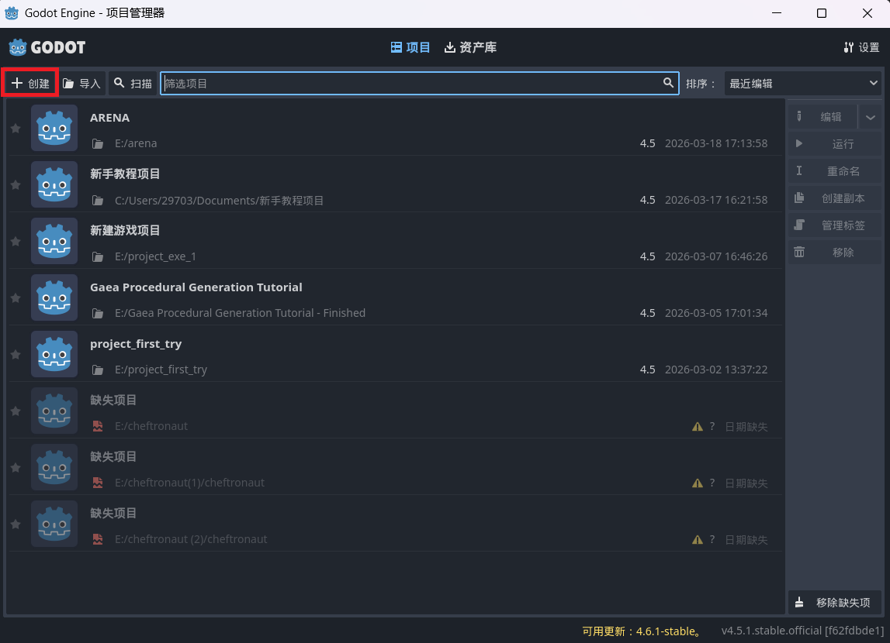  
*图 1-1：创建新项目向导*

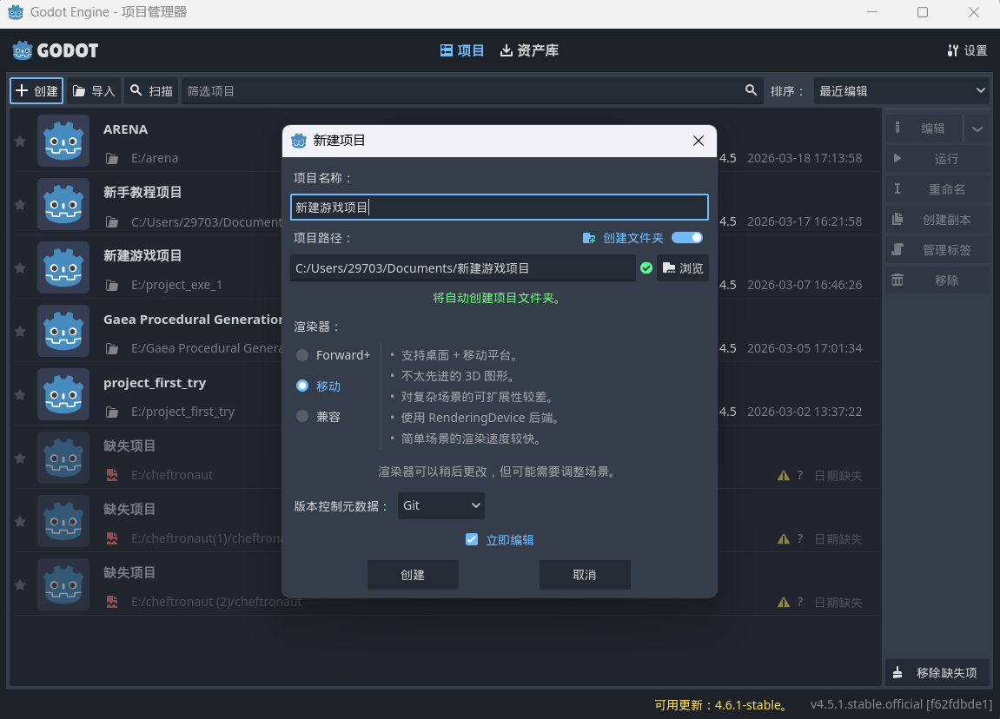  
*图 1-2：创建新项目界面*

- 更改项目名称为 `MyFirstGame`，或者任意你想要的名称
- 将项目路径改为便于找到的位置，如 `D:/GodotProjects/MyFirstGame`
- 选择 `Forward+` 渲染模式


### 1.2 整体布局

打开 Godot 后，你会看到如下界面分区：

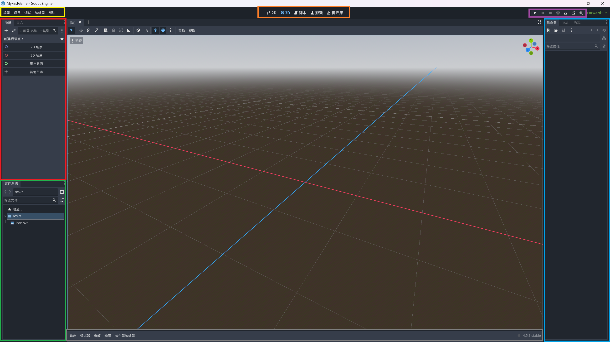  
*图 1-3：Godot 编辑器整体布局*

| 区域 | 位置 | 用途 | 图中颜色
|------|------|------|------|
| **菜单栏** | 顶部 | 文件保存、项目设置、调试运行 | 黄色
| **工具栏** | 菜单栏下方 | 切换 2D/3D/脚本/资源视图 | 橙色
| **场景树（Scene）** | 左侧 | 显示当前场景所有节点，可增删改 | 红色
| **2D 视口** | 中央 | 可视化摆放节点，预览游戏画面 | 中间的主要界面
| **检视器（Inspector）** | 右侧 | 修改选中节点的所有属性 | 蓝色
| **文件系统** | 底部左侧 | 管理项目内所有文件和资源 | 绿色
| **输出日志** | 底部中央 | 查看运行时打印信息和报错 | 灰色
| **快捷操作按钮** | 顶部右侧 | 运行项目、快速测试 | 紫色

---

### 1.3 场景树面板

场景树是你在编辑器里使用最频繁的面板。

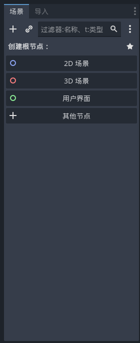  
*图 1-4：场景树面板*

**常用操作：**
- **添加节点**：点击场景树顶部的 `+` 图标
- **添加子节点**：选中节点后，点击场景树顶部的 `+` 图标，或按 `Ctrl+A`
- **重命名节点**：双击节点名称
- **删除节点**：选中后按 `Delete`
- **拖拽排序**：拖动节点可改变父子关系

---

### 1.4 检视器面板（Inspector）

选中任意节点后，右侧检视器会显示该节点的所有可调属性。

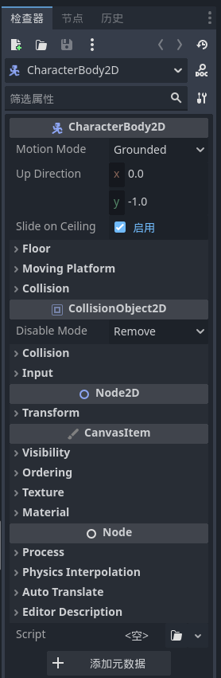  
*图 1-5：检视器面板示例（CharacterBody2D）*

> **💡 提示**：检视器中的属性分类折叠，点击分类名称可展开/收起。

---

### 1.5 文件系统面板

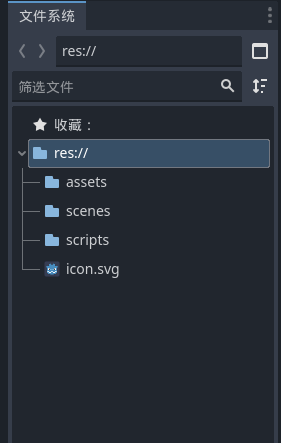  
*图 1-6：文件系统面板*

推荐将项目文件分为三大类存放：
- `scenes/` — `.tscn` 场景文件，每个游戏对象一个场景
- `scripts/` — `.gd` 脚本文件，控制节点行为的代码
- `assets/` — 图片、音效等美术资源

> **💡 提示**：可以为美术资源创建子目录，如 `assets/sprites/`、`assets/sounds/` 等。

---

### 1.6 运行游戏

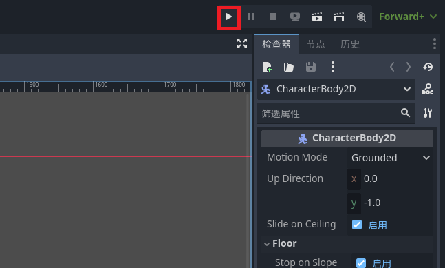  
*图 1-7：运行游戏的按钮*

| 快捷键 | 功能 |
|--------|------|
| `F5` | 运行整个项目（从主场景开始） |
| `F6` | 运行当前打开的场景 |
| `F8` | 停止运行 |

---

### 1.7 打开项目设置

项目设置包含全局配置，如碰撞层命名、主场景指定等。建议在开始制作任何场景之前先完成基础配置。

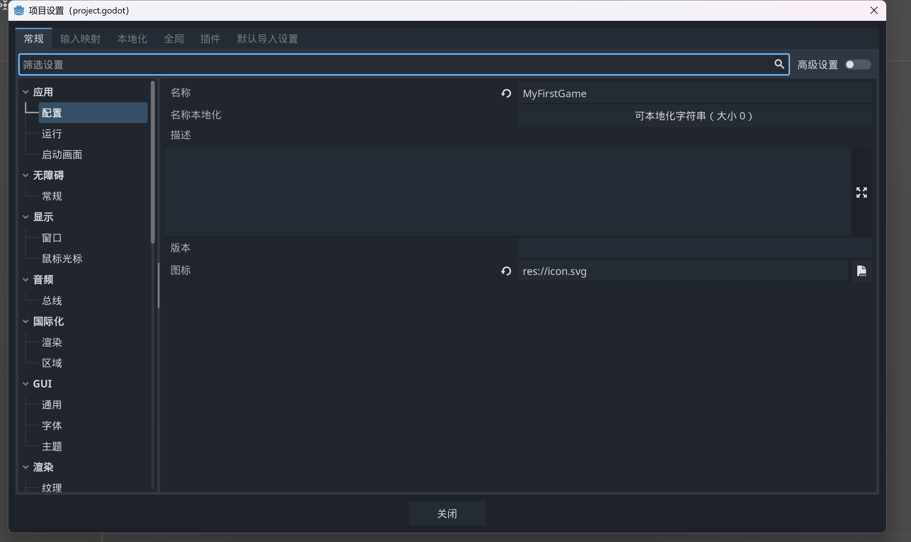
*图 1-8：通过顶部菜单打开项目设置*

在编辑器顶部菜单栏点击 `项目` → `项目设置`，即可打开项目设置窗口。本教程中会在需要配置的地方告知你进入哪个设置页面。

---

### 1.8 命名物理碰撞层

Godot 默认用数字区分物理层，命名后检视器中会显示层名（而非 Layer 1、Layer 2），方便后续章节设置碰撞层时识别。

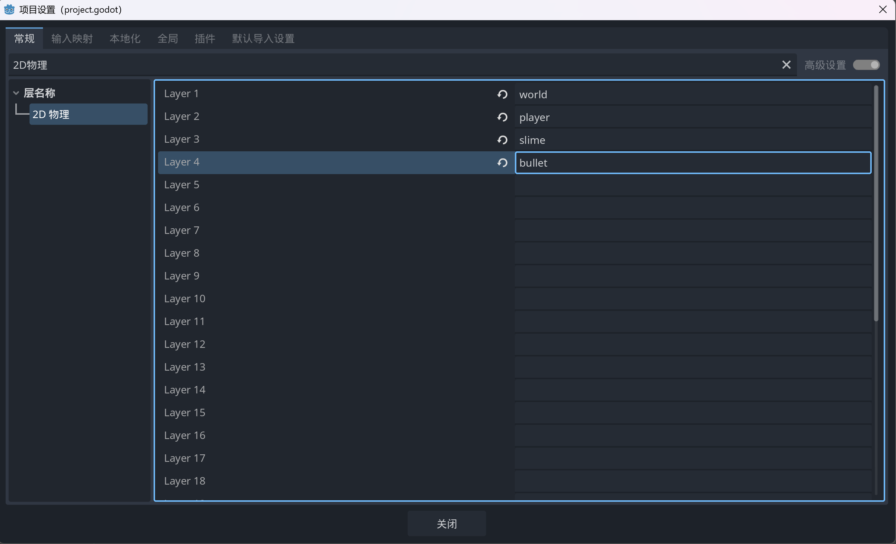
*图 1-9：在项目设置中为碰撞层命名，后续所有场景都会使用这套分层规则*

**操作步骤：**
1. 打开 `项目设置`（见上方 1.7）
2. 在左侧搜索框搜索 `2D物理`，点击展开
3. 按照下表依次填入层名：

| 层编号 | 名称 | 用途 |
|--------|------|------|
| Layer 1 | `world` | 地图 / 墙壁（TileMapLayer） |
| Layer 2 | `player` | 玩家角色（CharacterBody2D） |
| Layer 3 | `slime` | 史莱姆敌人 |
| Layer 4 | `bullet` | 子弹（Area2D） |

> **💡 提示**：命名完成后，后续章节在检视器中设置 `Collision Layer` 时，就会显示你填写的名称，而不是数字。

> **💡 说明**: 物理层命名只是为了方便识别，对实际运行并没有影响。

---

## 第二章：节点与场景基础操作

### 2.1 什么是节点（Node）

节点是 Godot 最基本的构建单元。**每个节点只做一件事**：

| 节点类型 | 职责 |
|----------|------|
| `AnimatedSprite2D` | 显示并播放帧动画 |
| `CollisionShape2D` | 定义物体的碰撞外形 |
| `Area2D` | 检测与其他物体的区域重叠 |
| `CharacterBody2D` | 提供角色物理移动能力 |
| `AudioStreamPlayer` | 播放音效 |
| `RayCast2D` | 向某方向发射射线，检测前方物体 |
| `CanvasLayer` | 独立于游戏世界的 UI 层（不随摄像机移动） |
| `TileMapLayer` | 用瓦片绘制地图（地面、墙壁） |
| `...` | ... |

---

### 2.2 创建新场景

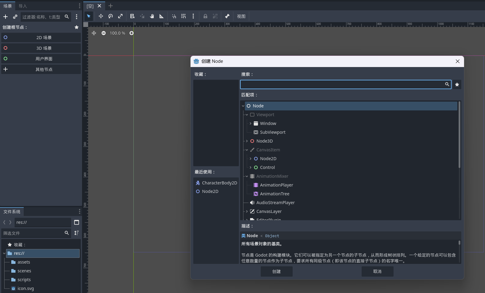  
*图 2-1：新建场景*

**步骤：**
1. 顶部工作区域的 `[空]` ，或点击右侧 `+` 图标创建新的场景
2. 在左侧场景树中点击 `+` 添加根节点，选择节点类型
3. 按 `Ctrl+S` 保存，文件名建议与功能对应（如 `player.tscn`）

---

### 2.3 向场景添加节点

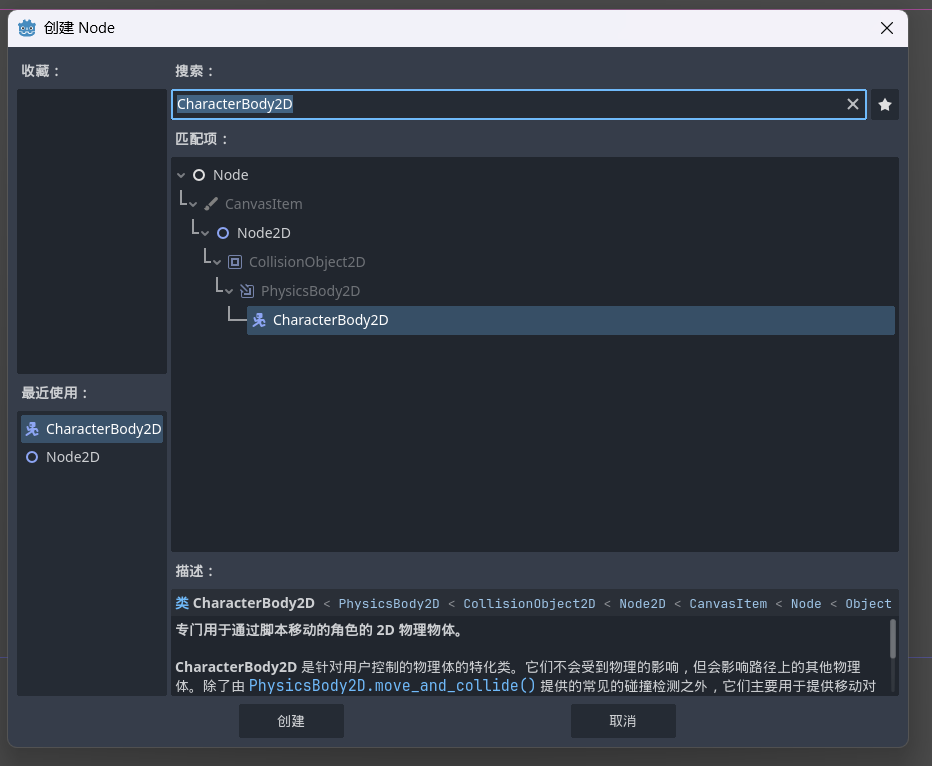  
*图 2-2：添加节点对话框，可搜索节点类型*

**步骤：**
1. 添加根节点 -> 按 `Ctrl+A` 或点击场景树上的 `+` 图标
2. 添加子节点 -> 在场景树中**先选中父节点** -> 重复步骤1
3. 在搜索框输入节点名称关键词，双击选中类型 `or` 在左侧收藏或最近使用列表中选择
4. 新节点出现在场景树中或父节点下方

> **💡 建议**：将所有场景名用大写英文首字母+小写英文全拼命名，且使用有意义的名称，不要使用下划线，与文件命名分开。例如：文件名`main_charactor.tscn`，场景名`MainCharactor`。
---

### 2.4 为节点附加脚本

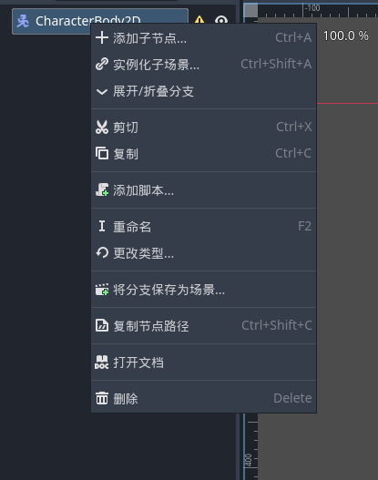  
*图 2-3：右键节点选择"添加脚本"(记得重命名根节点为有意义的名称)*

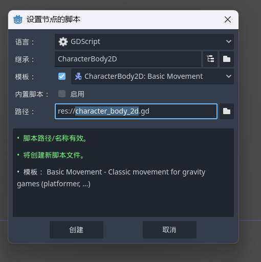  
*图 2-4：创建脚本对话框*

**步骤：**
1. 在场景树中选中要附加脚本的节点（通常是根节点）
2. 右键 → `创建脚本`
3. 设置脚本保存路径（建议放到 `scripts/` 目录），更改脚本名称
4. 点击 `创建` 完成

> **💡 提示**：脚本图标会出现在节点名称旁边，点击可跳转到代码编辑器。

> **💡 建议**：将所有保存的文件用小写英文加下划线`_`命名，且使用有意义的名称，方便管理。如：`main_charactor.gd`、`slime.tscn` 等，不要使用大写英文。
---

## 第三章：GDScript 核心语法

> 本章只讲本项目用到的语法，作为后续章节的参考手册。  
> 请务必保证输入代码时使用的是英文输入法，避免出现乱码问题。  
> 本章适合具有一定其他编程语言基础的读者大概了解 GDScript 语法。  

### 3.1 变量与常量

```gdscript
var hp = 100           # var：运行中会变化的值，用于设定变量
var speed: float = 150.0  # 可以在:后指定类型 float（小数）
const MAX_HP = 100      # const：永远不变的值（常量）
```

> `=` 或者 `:=` 让 Godot 自动判断类型；`const` 表示永远不变的值（常量），通常用于最大血量、速度上限等不变数值。

---

### 3.2 Godot 自动调用的生命周期函数

| 函数 | 触发时机 | 典型用途 |
|------|----------|----------|
| `_ready()` | 节点进入场景树时，执行**一次** | 初始化变量、连接信号 |
| `_process(delta)` | 每帧执行（约 60次/秒） | UI 更新、输入轮询 |
| `_physics_process(delta)` | 每物理帧执行（固定频率） | 移动、碰撞检测 |
| `_input(event)` | 有键盘/鼠标事件时执行 | 单次按键触发（如射击） |
| `_unhandled_input(event)` | 未被 UI 拦截的输入事件 | 暂停键等全局热键 |

```gdscript
# delta 的意义：让移动速度与帧率无关
# 无论 30fps 还是 60fps，角色每秒移动距离相同
position += direction * SPEED * delta
```

---

### 3.3 信号（Signal）——节点间通信

信号是 Godot 的"广播"机制，让不同节点之间松散地联系：

```gdscript
# ① 定义信号（在发送方脚本顶部）
signal died

# ② 发出信号（在某个条件满足时）
died.emit()

# ③ 在另一个节点中监听信号（通常在 _ready 中连接）
$MainCharactor.died.connect(_on_player_died)

# ④ 信号触发时执行的函数
func _on_player_died() -> void:
    $DeathScreen.show()
```

> **好处**：玩家脚本只管"我死了"，不需要知道死后发生什么；场景脚本负责响应。两者代码互不干扰。

---

### 3.4 向量 Vector2

2D 游戏中坐标和方向都用 `Vector2(x, y)` 表示：

```gdscript
Vector2(100, 0)    # 向右移动
Vector2(0, 100)    # 向下移动（Godot Y 轴朝下）
Vector2.ZERO       # 静止 (0, 0)

direction.normalized()       # 只保留方向，长度变为 1（防止对角线过快）
a.distance_to(b)             # 两点之间的距离
velocity.lerp(target, 0.1)   # 平滑过渡：每帧向 target 靠近 10%
```

---

### 3.5 节点引用

```gdscript
$AnimatedSprite2D          # 引用名为 AnimatedSprite2D 的直接子节点
$GunPivot/Muzzle           # 用 / 访问更深层的子节点
get_tree().get_nodes_in_group("slimes")  # 获取场景中所有在 slimes 组的节点
```

---

## 第四章：玩家角色场景（main_character.tscn）

> 本章将从一个**完全空白的场景文件**出发，每一节只添加一个节点，  
> 你可以清楚看到场景树是如何一步步从空白变为完整的玩家角色场景的。

**本章结束后，你将拥有如下完整节点树：**

```
MainCharacter（CharacterBody2D）  ← 根节点，控制物理移动
├── AnimatedSprite2D              ← 显示角色动画
├── CollisionShape2D              ← 角色的碰撞体（矩形）
├── Hitbox（Area2D）              ← 翻滚攻击的检测区域
│     └── CollisionShape2D       ← 翻滚攻击碰撞形状
├── HurtSound（AudioStreamPlayer）← 受伤音效
└── GunPivot（Node2D）            ← 枪的旋转轴心
      ├── handgun（实例）         ← 手枪外观（子场景）
      └── Muzzle（Node2D）        ← 枪口位置标记（子弹从这里生成）
```

---

### 4.1 创建空白场景文件

**当前场景树状态：**


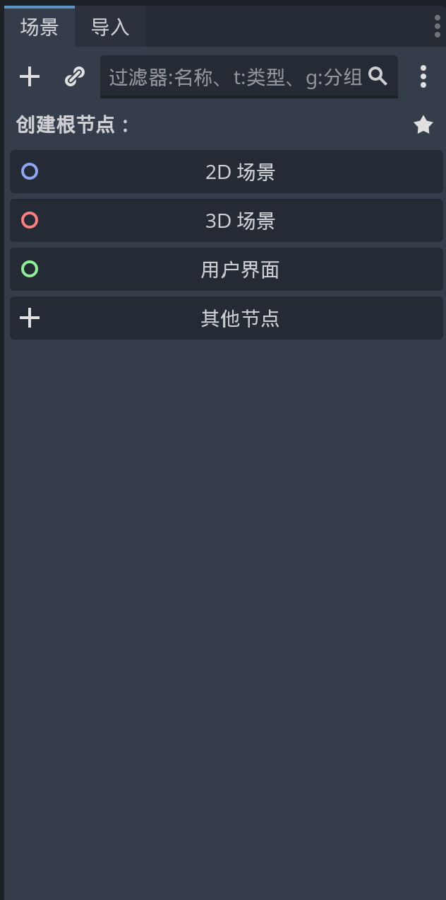  
*图 4-1：新建场景后，场景树为完全空白状态*

**操作步骤：**
1. 点击顶部工作区标签栏右侧的 `+` 图标，或菜单 `场景` -> `新建场景`
2. 此时左侧场景树面板为空，没有任何节点
3. 按 `Ctrl+S` 保存场景，命名为 `main_character.tscn`，保存到 `scenes/` 目录

> **💡 提示**：养成先保存空场景再添加节点的好习惯，避免未保存时意外丢失工作。

---

### 4.2 步骤一：添加根节点 CharacterBody2D

**当前场景树状态：**


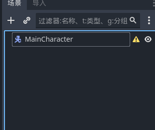  
*图 4-2：场景树中添加了根节点 CharacterBody2D，并重命名为 MainCharacter*

**为什么选 CharacterBody2D？**

`CharacterBody2D` 是专门为"可控制角色"设计的节点，它内置了 `move_and_slide()` 函数，可以在移动时自动处理与墙壁、地面的碰撞，不需要你手动写碰撞检测逻辑。

**操作步骤：**
1. 在空白场景树中点击 `+` 图标，搜索并添加 `CharacterBody2D`
2. 双击节点名称，将其重命名为 `MainCharactor`（注意：根节点名称即场景名称）
3. 按 `Ctrl+S` 保存

**在检视器（Inspector）中设置以下属性：**

| 属性 | 建议值 | 说明 |
|------|--------|------|
| `Collision Layer` | 第 2 层（player层） | 该节点"属于"哪个物理层，其他物体用此判断它是谁 |
| `Collision Mask` | 第 1 层（world层） | 该节点"检测"哪些层，设置为地图/墙壁所在层 |


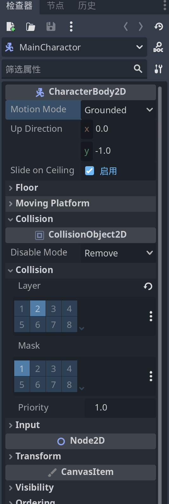  
*图 4-3：CharacterBody2D 的碰撞层与运动模式设置*

> **💡 说明**：碰撞层已在第一章 1.8 节统一命名，这里只需将玩家放第 2 层（player）、地图放第 1 层（world）即可。

---

### 4.3 步骤二：添加 AnimatedSprite2D（角色外观与动画）

**当前场景树状态：**

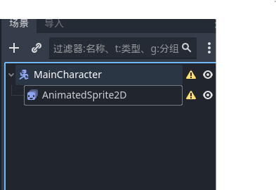  
*图 4-4：添加 AnimatedSprite2D 后，场景树更新*

**为什么选 AnimatedSprite2D？**

`AnimatedSprite2D` 可以管理多组帧动画（如站立、行走、死亡等），只需调用 `play("动画名")` 即可切换播放，非常适合控制动画的播放。

**操作步骤：**
1. 选中 `MainCharactor` 根节点
2. 按 `Ctrl+A`，搜索 `AnimatedSprite2D`，双击添加
3. 在检视器中找到 `Sprite Frames` 属性，点击 `[空]` → `新建 SpriteFrames`
4. 点击检视器底部弹出的动画编辑器，依次创建以下动画并导入对应帧图片

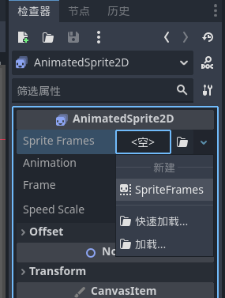  
*图 4-5：点击 Sprite Frames，新建SpriteFrames*

单击新建的 `SpriteFrames` ，进入底部的动画帧编辑器

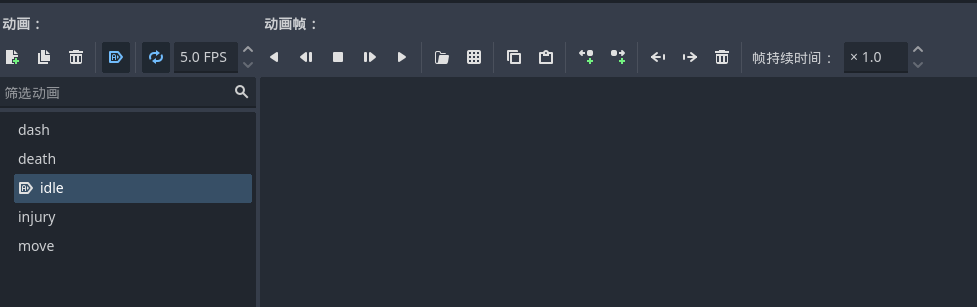  
*图 4-6：在动画编辑器中创建五个动画，名称必须与代码完全一致，将idle动画设为默认播放动画*

| 动画名 | 触发条件 | 是否循环 |
|--------|----------|---------|
| `idle` | 站立不动 | ✅ 循环 |
| `move` | 正在移动 | ✅ 循环 |
| `dash` | 翻滚冲刺中 | ✅ 循环 |
| `injury` | 受伤后短暂时间内 | ✅ 循环 |
| `death` | 血量归零 | ❌ **不循环** |

> **💡 重要**：`death` 动画必须关闭循环（在动画编辑器中点击循环图标取消高亮），否则死亡动画播完后会重新播放，死亡逻辑可能出现问题。

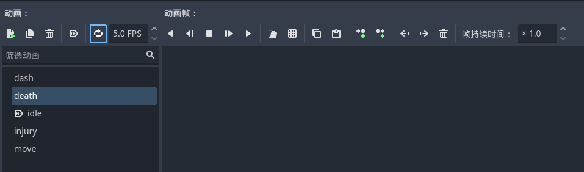  
*图 4-7：`death` 动画必须关闭循环*

**动画帧的添加：**

1. 创建新动画，为其命名；
2. 选中该动画，按下 `ctrl+shift+O` 添加帧图片；
3. 在文件夹中找到对应的精灵表图片并打开；
4. 选择这个动画需要的帧图片添加到动画中；
5. 设置动画的属性，并按下 `D` 播放动画，检查帧是否添加正确。

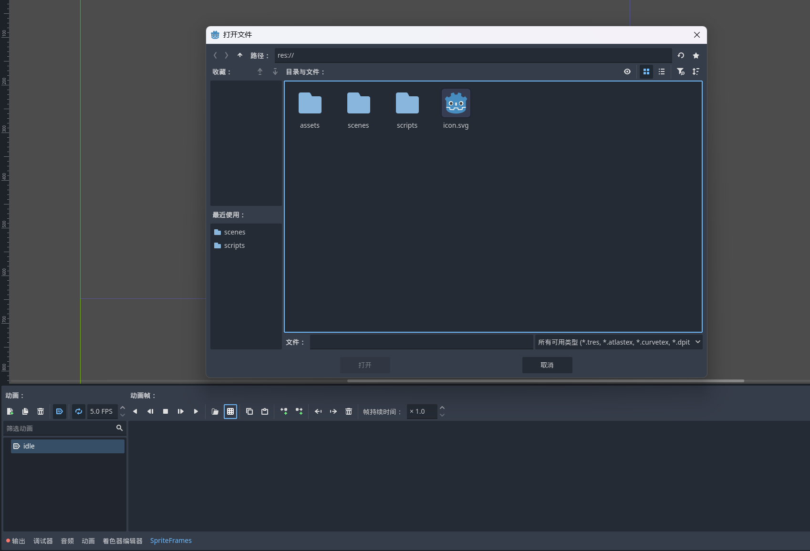  
*图 4-8：动画帧编辑器中为动画选择精灵表*

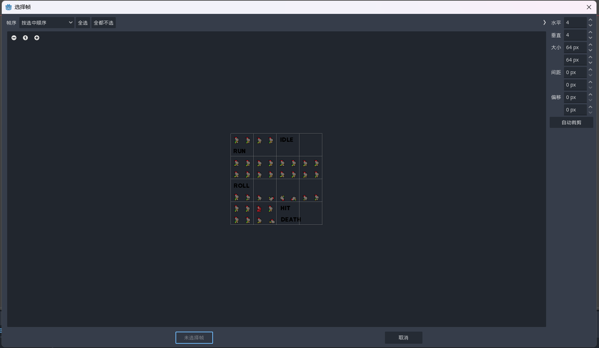  
*图 4-9：动画帧编辑器中选择动画帧*

**如何选择动画帧**

> **水平/垂直**两个数据，分别可以更改在水平/垂直方向上将图片分割成多少份  
> **大小**属性会更改每个格子的大小   
> **间距**属性会分别更改水平/垂直方向上每个格子间的间距  
> **偏移**属性会在不影响总体大小的前提下，整体移动图片  

当你将该精灵图裁剪为需要的属性后，即可在动画编辑器中点击帧图片添加到动画中。

> 也许你已经注意到了，现在添加的动画并不是像素的，而是十分模糊的。
> 这是因为Godot会自动进行纹理平滑处理，使纹理看起来更模糊。

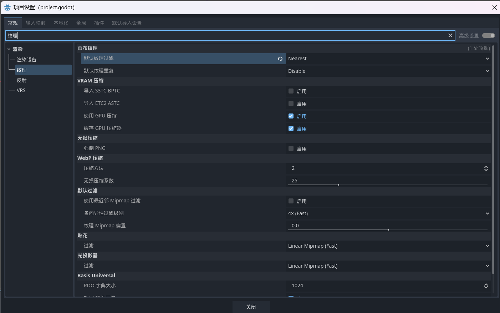   
*图 4-10：更改纹理过滤模式*

**设置纹理过滤器：**

1. 打开`项目设置`，搜索`纹理`
2. 将`默认纹理过滤`从`Linear`设置为`Nearest`

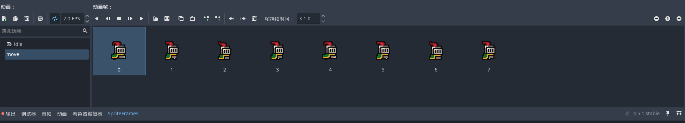
*图 4-11：设置动画帧率*

**更改动画速度：**

> 在这个动画编辑器中，还有一个`动画速度`属性，可以更改动画的播放速度。  
> 在`自动播放`按钮边上，有一个更改fps的属性，可以更改动画的帧率。  

> 该属性的数值决定了你的游戏每秒会为这个动画播放多少帧。
> 数值越大，每秒播放的帧数越多，动画播放速度越快。  
> 通常来讲，角色动画的帧率并没有定值，它取决于动画的帧数与你希望的播放速度。  
> 所以，你可以根据需要调整帧率，以实现你希望的动画播放速度。  

**以下是参考的动画设置：**
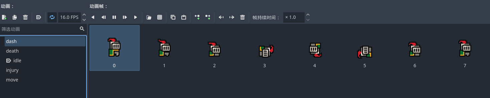
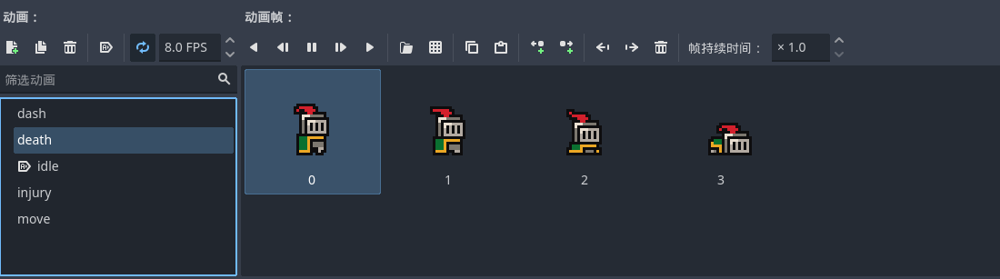
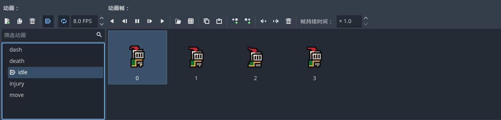
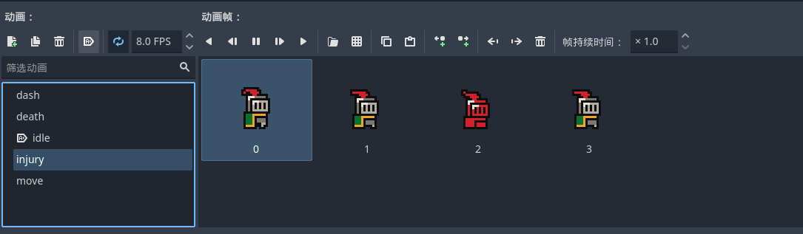
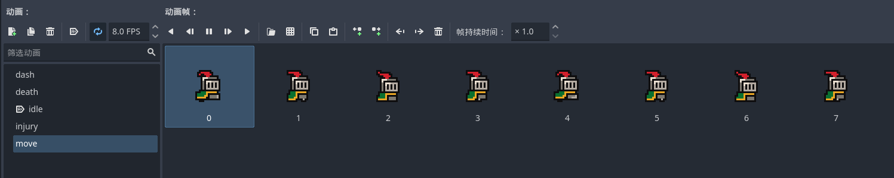


### 4.4 步骤三：添加 CollisionShape2D（物理碰撞形状）

**当前场景树状态：**

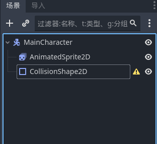  
*图 4-12：设置碰撞形状*

**为什么需要 CollisionShape2D？**

`CharacterBody2D` 本身没有形状，必须给它添加一个 `CollisionShape2D` 子节点来告诉 Godot"角色的身体是什么形状"。没有碰撞形状，角色会直接穿过所有墙壁。

**操作步骤：**
1. 选中 `MainCharactor` 根节点，按 `Ctrl+A` 添加 `CollisionShape2D`
2. 在检视器中点击 `Shape` 属性旁的下拉菜单，选择 `新建 RectangleShape2D`
3. 在 2D 视口中拖动碰撞框的边角控制点，让矩形框与角色图像贴合

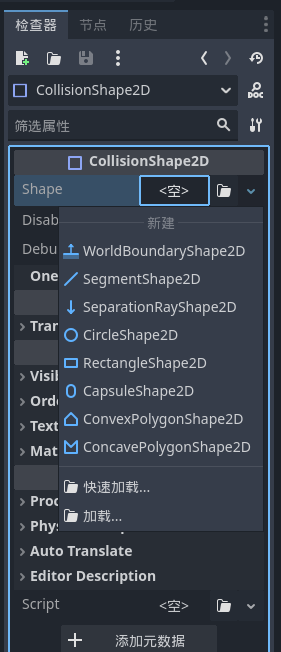  
*图 4-13：创建角色碰撞箱（建议选用矩形或者圆形）*

**检视器关键属性：**

| 属性 | 建议值 | 说明 |
|------|--------|------|
| `Shape` | `RectangleShape2D` | 矩形碰撞体，适合人形角色 |
| `Shape → Size` | 约 `(8, 7.25)` | 宽和高（像素），根据角色实际大小调整 |
| `Disabled` | `false`（默认） | 碰撞默认开启，死亡时代码会将其设为 true |

> **💡 技巧**：碰撞框建议比角色图像略小一点（内缩 2~3 像素），并根据游戏视角调整大小，游戏手感会更宽松自然。

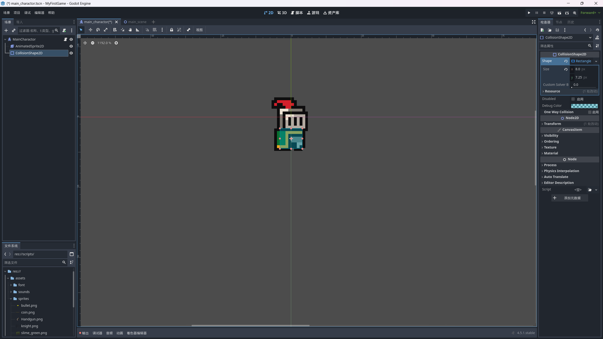  
*图 4-14：调整碰撞框大小(以idle动画为模板)*

---

### 4.5 步骤四：添加 Hitbox（翻滚攻击检测区域）

**当前场景树状态：**

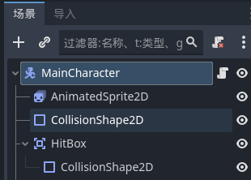   
*图 4-15：Hitbox 是一个 Area2D，它也需要自己的 CollisionShape2D 来定义检测范围*

**为什么需要 Hitbox？**

玩家翻滚冲刺时可以攻击史莱姆。`Area2D` 能检测"是否有其他物体进入我的范围"，非常适合做攻击判定。`Area2D`还可以单独控制物理层的碰撞，与物理碰撞分离。

**操作步骤：**
1. 选中 `MainCharactor` 根节点，按 `Ctrl+A` 添加 `Area2D`，重命名为 `Hitbox`
2. 选中刚添加的 `Hitbox`，按 `Ctrl+A` 为其添加 `CollisionShape2D` 子节点
3. 为这个 `CollisionShape2D` 设置形状（同样使用 `RectangleShape2D`，大小与角色碰撞箱可以不同）

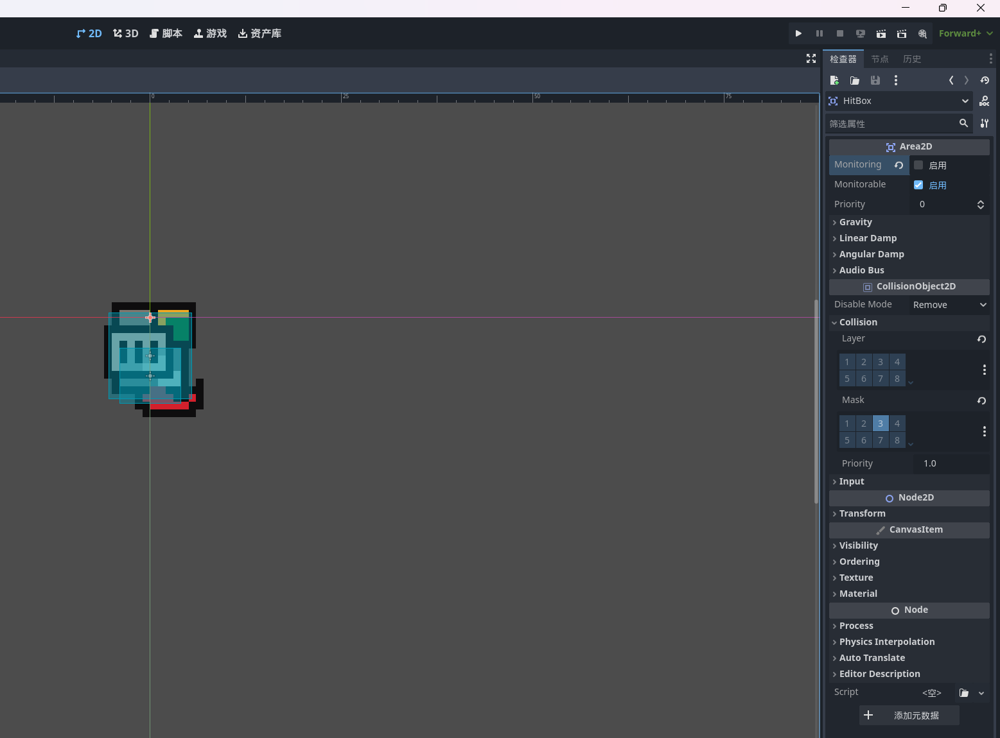   
*图 4-16：Hitbox 碰撞箱设置和检查器设置*

**检视器关键属性（选中 Hitbox 节点时设置）：**

| 属性 | 值 | 说明 |
|------|-----|------|
| `Monitoring` | `false`（关闭） | 是否主动检测进入范围的其他物体；翻滚时由代码开启 |
| `Monitorable` | `true`（开启） | 是否允许被其他 Area2D 检测到（子弹需要检测到它） |
| `Collision Layer` | 不需要设置 | Hitbox 不"属于"任何层 |
| `Collision Mask` | 史莱姆所在层 | 只检测史莱姆，避免误触玩家自身 |

---

### 4.6 步骤五：添加 HurtSound（受伤音效）

**当前场景树状态：**


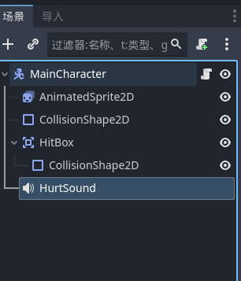   
*图 4-17：新增AudioStreamPlayer 节点，重命名为HurtSound*

**为什么需要 AudioStreamPlayer？**

`AudioStreamPlayer` 是 Godot 中播放音效的标准节点，调用 `play()` 即可播放。将它挂在玩家节点下，受伤时代码直接 `$HurtSound.play()` 即可发声，不需要额外管理音效生命周期。

**操作步骤：**
1. 选中 `MainCharactor` 根节点，按 `Ctrl+A` 添加 `AudioStreamPlayer`，重命名为 `HurtSound`
2. 在检视器中点击 `Stream` 属性旁的下拉框，选择 `快速加载`，找到受伤音效文件（`hurt.wav` ）

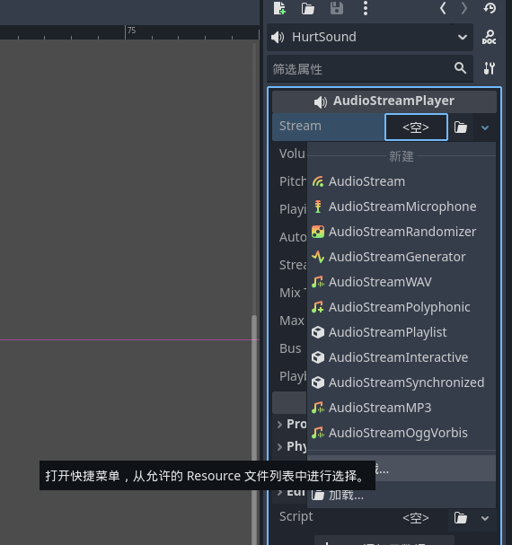   
*图 4-18：更改 HurtSound 的 Stream 属性*

**检视器关键属性：**

| 属性 | 建议值 | 说明 |
|------|--------|------|
| `Stream` | 受伤音效文件 | 拖入或选择音频资源文件 |
| `Volume Db` | `0.0` | 音量（分贝），0 为原始音量，负数更安静 |
| `Autoplay` | `false` | 不自动播放，由代码在受伤时调用 `play()` |

---

### 4.7 完整场景确认（第七章前）

完成以上步骤后，你的场景树应如下所示（共 6 个节点）：

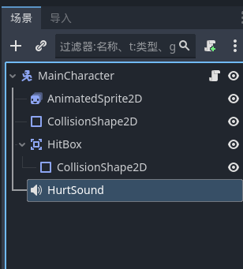  
*图 4-19：第七章前的玩家角色节点树，共 6 个节点*


> **💡 说明**：`GunPivot`（枪械系统）需要先完成**第七章**的手枪场景（`handgun.tscn`）再安装，详见 **7.10 节**。

> 按 `Ctrl+S` 保存场景后，进入下一节为场景附加脚本。

---

### 4.8 配置输入映射（Input Map）

在为玩家编写移动脚本之前，需要先在项目设置中定义"动作（Action）"——即把按键绑定到有意义的名称上。代码中用 `Input.get_axis("move_left", "move_right")` 读取输入，这些名称必须与 Input Map 中**完全一致**。

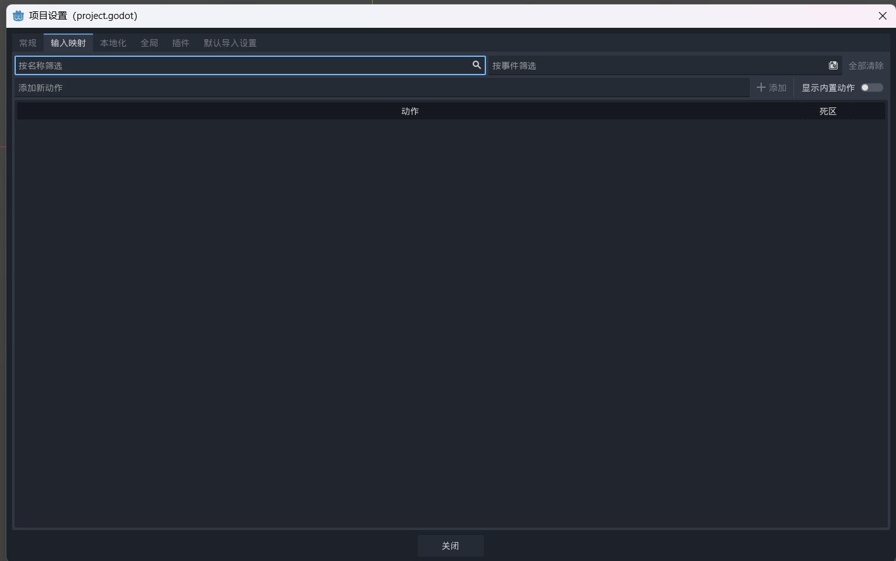  
*图 4-20：项目设置中的输入映射界面*

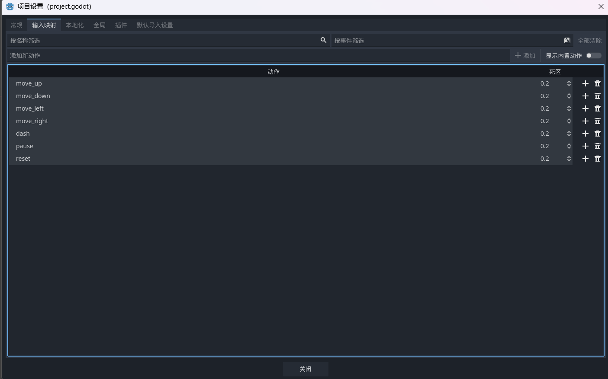  
*图 4-21：输入动作名后点击添加添加动作*

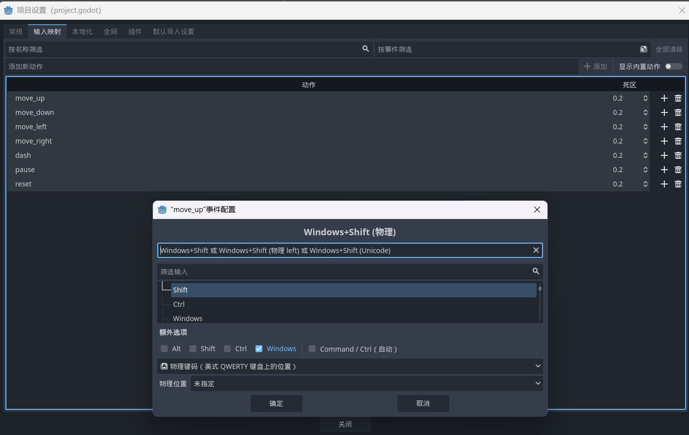  
*图 4-22：在对应动作名下添加按键映射*

**操作步骤：**
1. 菜单栏点击 `项目` → `项目设置`，切换到 `输入映射` 标签页
2. 在顶部 `添加新动作` 输入框输入动作名（如 `move_up`），点击 `+添加`
3. 新动作出现在列表中，点击其右侧 `+` 图标
4. 在弹出的对话框中**按下目标键**（如 `W`），完成绑定

本项目需要配置以下所有动作：

| 动作名 | 绑定按键 | 用途 |
|--------|----------|------|
| `move_up` | `W` | 向上移动 |
| `move_down` | `S` | 向下移动 |
| `move_left` | `A` | 向左移动 |
| `move_right` | `D` | 向右移动 |
| `dash` | `Shift` | 翻滚冲刺 |
| `pause` | `Escape` | 暂停/继续 |
| `reset` | `R` | 长按重置游戏 |

> **💡 说明**：`pause` 和 `reset` 在第七章主场景脚本中使用，这里一并配置好，避免后续遗漏。

---

### 4.9 附加脚本（main_character.gd）函数说明

**操作步骤：**
1. 选中根节点 `MainCharacter`
2. 右键 → `创建脚本`，保存路径设为 `scripts/main_character.gd`
3. 点击 `创建`，脚本编辑器自动打开

---

#### 脚本顶部：继承声明、信号与常量

```gdscript
extends CharacterBody2D

signal died

const SPEED          = 150.0   # 移动速度
const DASH_SPEED     = 400.0   # 冲刺速度
const DASH_DURATION  = 0.25    # 冲刺持续时间（秒）
const DASH_COOLDOWN  = 1.0     # 冲刺冷却时间（秒）
const MAX_HP         = 100     # 最大生命值
const DASH_DAMAGE    = 20      # 冲刺碰到敌人造成的伤害
```

- `signal died`：自定义信号，死亡动画结束后发出，主场景收到后显示死亡界面。
- 常量全部大写，运行期间不可修改，方便统一调整数值。

---

#### 脚本顶部：变量声明

```gdscript
var hp           := MAX_HP       # 当前生命值
var health_bar: ProgressBar      # 代码创建的血条节点（引用）

var is_dashing          := false         # 是否正在冲刺
var dash_timer          := 0.0           # 冲刺剩余时间
var dash_cooldown_timer := 0.0           # 冲刺冷却剩余时间
var dash_direction      := Vector2.ZERO  # 冲刺方向
var _dash_slimes_hit: Array = []         # 本次冲刺已经命中的史莱姆（防止重复伤害）

var is_injured     := false   # 是否处于受伤无敌帧
var injury_timer   := 0.0     # 受伤无敌帧剩余时间
const INJURY_DURATION = 0.5   # 受伤无敌时长（秒）

var is_dead := false          # 是否已死亡（死亡后停止所有逻辑）
```

---

#### `_ready()` — 初始化

```gdscript
func _ready() -> void:
	add_to_group("player")          # 加入 "player" 组，供其他脚本通过组名找到玩家
	health_bar = ProgressBar.new()  # 用代码动态创建血条节点（无需在编辑器手动添加）
	health_bar.max_value       = MAX_HP
	health_bar.value           = hp
	health_bar.show_percentage = false     # 不显示百分比文字
	health_bar.position        = Vector2(-16, -22)  # 血条显示在角色头顶
	health_bar.size            = Vector2(32, 5)     # 血条宽高（像素）
	add_child(health_bar)           # 将血条作为子节点加入场景
```

> 血条用代码创建是为了避免在编辑器手动添加 UI 节点时与玩家场景产生耦合；`show_percentage = false` 让血条只显示颜色色块。

---

#### `_physics_process(delta)` — 每物理帧：移动、冲刺与动画

```gdscript
func _physics_process(delta: float) -> void:
	if is_dead:
		return                  # 死亡后停止所有逻辑
	var anim := $AnimatedSprite2D

	# ── 受伤无敌帧计时 ──────────────────────────────────────
	if is_injured:
		injury_timer -= delta
		if injury_timer <= 0.0:
			is_injured = false

	# ── 冲刺冷却计时 ─────────────────────────────────────────
	if dash_cooldown_timer > 0.0:
		dash_cooldown_timer -= delta

	# ── 冲刺持续阶段 ─────────────────────────────────────────
	if is_dashing:
		dash_timer -= delta
		if dash_timer <= 0.0:
			is_dashing = false
			$Hitbox.monitoring = false   # 冲刺结束，关闭攻击检测
			_dash_slimes_hit.clear()     # 清空命中记录
		else:
			# 冲刺期间检测是否碰到史莱姆 Hitbox
			for area in $Hitbox.get_overlapping_areas():
				var slime = area.get_parent()
				if slime != null and slime.has_method("take_damage") and not slime in _dash_slimes_hit:
					_dash_slimes_hit.append(slime)      # 记录已命中，防止重复伤害
					slime.take_damage(DASH_DAMAGE)
		velocity = dash_direction * DASH_SPEED
		move_and_slide()
		anim.play("dash")                        # 播放冲刺动画
		if dash_direction.x > 0:
			anim.flip_h = false
		elif dash_direction.x < 0:
			anim.flip_h = true
		return                                   # 冲刺期间跳过后续普通移动逻辑

	# ── 读取方向输入 ──────────────────────────────────────────
	var direction := Vector2(
		Input.get_axis("move_left",  "move_right"),
		Input.get_axis("move_up",    "move_down")
	)

	# ── 触发冲刺 ──────────────────────────────────────────────
	if Input.is_action_just_pressed("dash") and dash_cooldown_timer <= 0.0:
		if direction != Vector2.ZERO:
			dash_direction = direction.normalized()           # 按输入方向冲刺
		else:
			dash_direction = Vector2(-1 if anim.flip_h else 1, 0)  # 无输入则沿当前朝向冲刺
		is_dashing          = true
		dash_timer          = DASH_DURATION
		dash_cooldown_timer = DASH_COOLDOWN
		_dash_slimes_hit.clear()
		$Hitbox.monitoring  = true    # 开启翻滚攻击检测
		return

	# ── 普通移动 ──────────────────────────────────────────────
	if direction != Vector2.ZERO:
		velocity = direction.normalized() * SPEED
	else:
		velocity = Vector2.ZERO
	move_and_slide()

	# ── 播放动画 ──────────────────────────────────────────────
	if is_injured:
		anim.play("injury")           # 受伤动画优先级最高
	elif velocity != Vector2.ZERO:
		anim.play("move")
	else:
		anim.play("idle")

	if velocity.x > 0:
		anim.flip_h = false           # 向右移动时朝右
	elif velocity.x < 0:
		anim.flip_h = true            # 向左移动时翻转
```

> `_dash_slimes_hit` 数组记录本次冲刺已命中的史莱姆，防止同一次冲刺在多帧内对同一只史莱姆重复造成伤害。

> `move_and_slide()` 是 Godot 内置函数，根据 `velocity` 移动角色并自动滑动绕过障碍物边角。

---

#### `take_damage(amount)` — 受到伤害

```gdscript
func take_damage(amount: int) -> void:
	if is_dashing:
		return                    # 翻滚期间无敌，直接忽略伤害
	if is_dead or hp <= 0:
		return                    # 已死亡则跳过
	hp -= amount
	hp = max(0, hp)             # 血量最低为 0，不能为负
	health_bar.value = hp       # 更新血条显示
	$HurtSound.play()           # 播放受伤音效
	is_injured    = true
	injury_timer  = INJURY_DURATION   # 开启受伤无敌计时
	if hp <= 0:
		_die()
```

> 冲刺时 `is_dashing = true`，`take_damage` 直接 `return`，实现翻滚无敌帧。

---

#### `_die()` — 死亡处理

```gdscript
func _die() -> void:
	is_dead = true
	velocity = Vector2.ZERO
	$CollisionShape2D.set_deferred("disabled", true)  # 禁用碰撞（deferred：下帧执行，物理安全）
	health_bar.hide()
	var anim := $AnimatedSprite2D
	anim.sprite_frames.set_animation_loop("death", false)  # 确保 death 动画不循环
	anim.play("death")
	await anim.animation_finished   # 等待死亡动画播放完毕
	if is_inside_tree():            # 确认节点还在场景中（防止场景重载时报错）
		died.emit()                 # 发出死亡信号 → main_scene 收到后显示死亡界面
```

> `set_deferred("disabled", true)` 表示"推迟到本帧物理步骤结束后再执行"，直接写 `disabled = true` 在物理回调中可能导致报错。

> `await` 是 GDScript 的协程关键字，让函数"暂停在这里等待信号"，不会阻塞游戏主线程。

---

> **💡 枪械控制相关脚本说明**：`_shoot()` 函数以及玩家脚本中需要添加的鼠标跟随旋转、射击按键等枪械逻辑，将在完成第五章后的 **7.11 节** 统一讲解。

> **💡 脚本运行说明**：请确保脚本中绑定的所有节点名（如 `$Hitbox`）都正确，否则会导致运行时错误。
---

## 第五章：金币与主场景搭建

> 第四章完成了玩家角色。本章将创建**金币场景**（coin.tscn）和**游戏主场景**（main_scene.tscn）——搭建地图、放置金币、配置玩家跟随镜头，并制作暂停、死亡、胜利等 UI 界面。
>
> ⚠️ 本章暂不加入史莱姆敌人（第六章完成后再放入），因此胜利界面目前无法触发，但游戏已可正常运行、移动和拾取金币。

**本章结束后，你将拥有以下两个场景：**

```
coin（CharacterBody2D）
├── AnimatedSprite2D             ← 金币外观动画
├── CollisionShape2D             ← 金币本体碰撞
├── PickupArea（Area2D）         ← 拾取检测区域
│   └── CollisionShape2D         ← 拾取区域形状
└── CoinSound（AudioStreamPlayer） ← 拾取音效
```

```
MainScene（Node2D）
├── background（TileMapLayer）              ← 背景装饰层
├── wall（TileMapLayer）                    ← 墙壁碰撞层
├── ground（TileMapLayer）                  ← 地面碰撞层
├── MainCharacter（main_character.tscn 实例）
│   └── Camera2D                           ← 跟随玩家的镜头
├── coin × N（coin.tscn 实例）
├── DeathScreen（CanvasLayer）
├── PauseMenu（CanvasLayer）
├── VictoryScreen（CanvasLayer）            ← 本章暂无法触发
└── CoinHUD（CanvasLayer）                  ← 金币计数 + 重置进度条
```

---

## 一、金币场景（coin.tscn）

### 5.1 创建空白场景文件（coin.tscn）

**当前场景树状态：**
```
（空）
```

**操作步骤：**
1. 点击工作区标签栏的 `+` 新建场景
2. 按 `Ctrl+S` 保存为 `coin.tscn`，保存到 `scenes/` 目录

---

### 5.2 步骤一：添加根节点 CharacterBody2D

**当前场景树状态：**

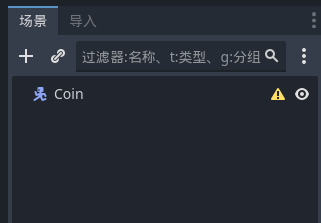  
*图 5-1：金币根节点选用 CharacterBody2D，为金币提供物理图层配置*

**为什么选 CharacterBody2D？**

金币本身不移动，但需要配置物理图层（Layer / Mask），方便玩家按层进行碰撞检测。`CharacterBody2D` 提供了完整的物理层配置而无需额外开销。

**操作步骤：**
1. 在空白场景树中点击 `其他节点`，搜索并添加 `CharacterBody2D`
2. 双击节点名称，重命名为 `Coin`
3. 按 `Ctrl+S` 保存

| 属性 | 建议值 | 说明 |
|------|--------|------|
| `Collision` | `Layer` -> `取消所有层`，`Mask` -> `取消所有层` | 去除layer和mask，确保硬币不会被识别为墙体发生碰撞 |

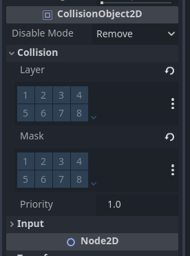  
*图 5-2：金币根节点的 Collision 属性已取消所有层，确保硬币不会被识别为墙体发生碰撞*

---

### 5.3 步骤二：添加 AnimatedSprite2D（金币外观）

**当前场景树状态：**

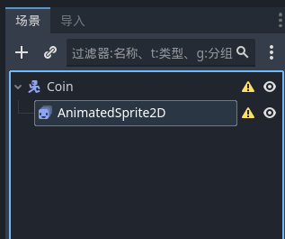  
*图 5-3：添加 AnimatedSprite2D 后金币贴图出现在视口中*

**操作步骤：**
1. 选中 `coin` 根节点，按 `Ctrl+A` 添加 `AnimatedSprite2D`
2. 在检视器中点击 `Sprite Frames` → `新建 SpriteFrames`，导入金币贴图帧

**检视器关键属性：**

| 属性 | 建议值 | 说明 |
|------|--------|------|
| `Sprite Frames` | 导入金币旋转/闪光动画 | 可以是静态单帧，也可以有旋转循环动画 |
| `Playing` | `true` | 自动播放金币动画 |

> 具体操作与4.3节的内容一致，这里不再赘述

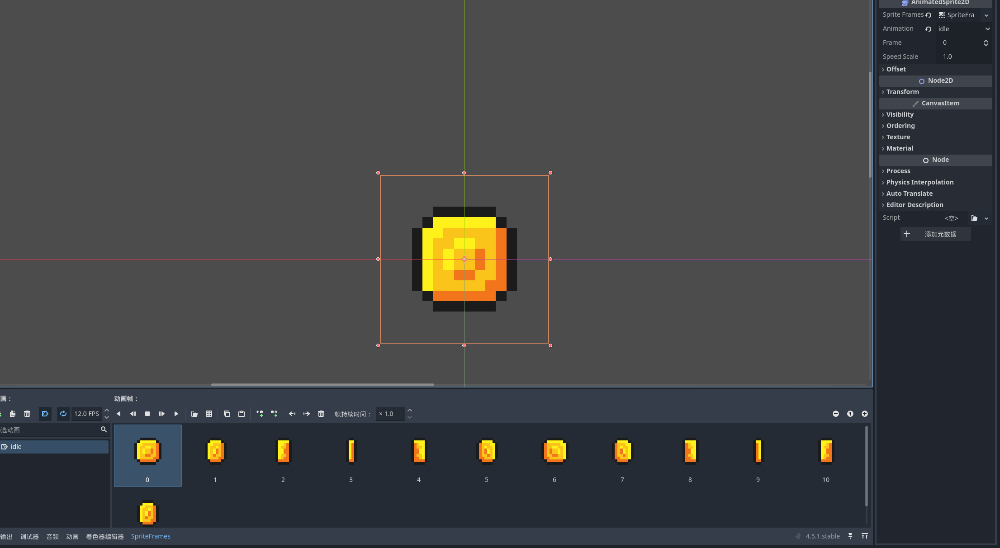  
*图 5-4：参考硬币参数*

---

### 5.4 步骤三：添加 CollisionShape2D（金币本体碰撞）

**当前场景树状态：**

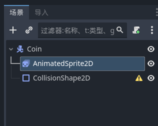  
*图 5-5：为金币添加 CollisionShape2D*

**操作步骤：**
1. 选中 `coin` 根节点，按 `Ctrl+A` 添加 `CollisionShape2D`
2. 在检视器中选择 `CircleShape2D`，调整半径与金币贴图匹配

**检视器关键属性：**

| 属性 | 值 | 说明 |
|------|-----|------|
| `Shape` | `CircleShape2D` | 圆形碰撞体，适合圆形金币 |
| `Shape → Radius` | 与贴图半径一致 | 避免碰撞体与外观不匹配 |

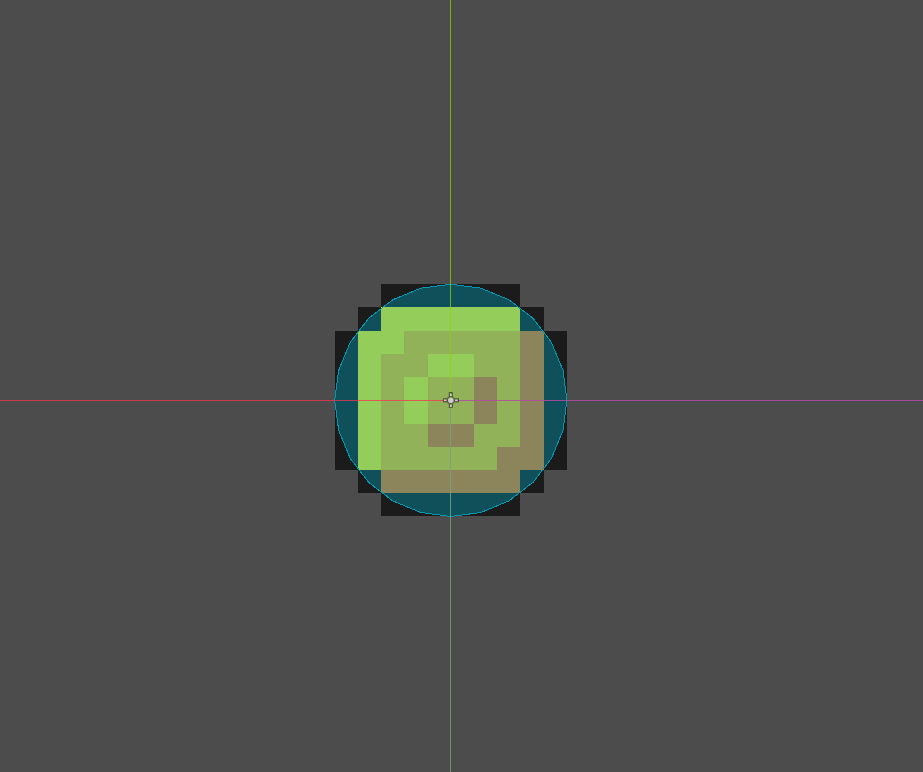  
*图 5-6：为金币添加 CollisionShape2D*

---

### 5.5 步骤四：添加 PickupArea（拾取检测区域）

**当前场景树状态：**

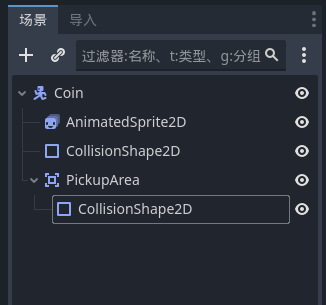  
*图 5-7：PickupArea 的检测范围可以比金币本体稍大，方便玩家拾取*

**为什么需要单独的 PickupArea？**

金币本体的 `CollisionShape2D` 负责物理防穿透，而 `PickupArea`（`Area2D`）负责**检测玩家是否碰触金币**——二者职责分离，互不干扰。

**操作步骤：**
1. 选中 `coin` 根节点，按 `Ctrl+A` 添加 `Area2D`，命名为 `PickupArea`
2. 选中 `PickupArea`，按 `Ctrl+A` 继续添加 `CollisionShape2D`，选择 `CircleShape2D`
3. 半径可略大于金币本体，方便拾取

**检视器关键属性（PickupArea）：**

| 属性 | 值 | 说明 |
|------|-----|------|
| `Collision Layer` | `取消所有层` | 确保金币只被玩家检测到 |
| `Collision Mask` | 第 2 层（player） | 只检测玩家，不误触其他物体 |

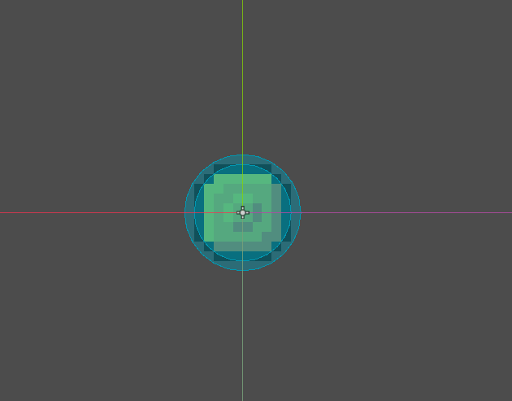  
*图 5-8：为金币添加拾取范围*

---

### 5.6 步骤五：添加 CoinSound（拾取音效）

**当前场景树状态：**

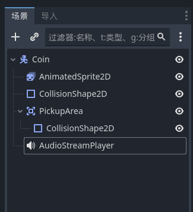  
*图 5-9：为金币添加拾取音效*

**操作步骤：**
1. 选中 `coin` 根节点，按 `Ctrl+A` 添加 `AudioStreamPlayer`，命名为 `CoinSound`
2. 在检视器中点击 `Stream` 字段，导入金币拾取音效文件（`coin.wav`）

**检视器关键属性：**

| 属性 | 值 | 说明 |
|------|-----|------|
| `Stream` | 导入拾取音效文件 | 金币被拾取时由脚本调用播放 |
| `Autoplay` | `false` | 不自动播放 |

---

### 5.7 完整场景确认（coin.tscn）

```
coin（CharacterBody2D）              ← 根节点，提供物理图层
├── AnimatedSprite2D                 ← 金币外观与动画
├── CollisionShape2D                 ← 金币本体碰撞形状
├── PickupArea（Area2D）             ← 拾取检测区域
│   └── CollisionShape2D             ← 拾取区域碰撞形状
└── CoinSound（AudioStreamPlayer）   ← 拾取音效
```

---

### 5.8 附加脚本（coin.gd）

**操作步骤：**
1. 选中根节点 `coin`
2. 右键 → `创建脚本`，保存路径设为 `scripts/coin.gd`
3. 点击 `创建`，脚本编辑器自动打开

```gdscript
extends CharacterBody2D

signal collected
```

- `signal collected`：金币被玩家拾取时发出，主场景收到后更新金币计数。

---

#### `_ready()` — 初始化

```gdscript
func _ready() -> void:
	add_to_group("coins")                                         # 加入 "coins" 组，供主场景批量连接信号
	$PickupArea.body_entered.connect(_on_pickup_area_body_entered)
```

> 使用 `body_entered` 信号（而非 `area_entered`）：玩家是 `CharacterBody2D`（属于"body"），当它进入 `Area2D` 时触发此信号。

---

#### `_on_pickup_area_body_entered(body)` — 拾取逻辑

```gdscript
func _on_pickup_area_body_entered(body: Node2D) -> void:
	if body.is_in_group("player"):
		$PickupArea.monitoring = false                            # 立即禁止重复触发
		collected.emit()                                         # 发出信号 → 主场景计数
		$AnimatedSprite2D.hide()                                 # 隐藏金币外观
		$CollisionShape2D.set_deferred("disabled", true)         # 禁用碰撞
		$CoinSound.play()                                        # 播放拾取音效
		await $CoinSound.finished                                # 等待音效播放完毕
		queue_free()                                             # 从场景中移除节点
```

> `queue_free()` 在当前帧处理完毕后安全销毁节点，避免在物理回调中直接删除引发错误。

---

## 二、为玩家添加跟随镜头（返回 main_character.tscn）

> 在搭建主场景之前，先回到第四章制作好的玩家场景，为其添加 `Camera2D` 跟随镜头。

### 5.9 在玩家场景中添加 Camera2D

**操作步骤：**
1. 在文件系统面板双击打开 `scenes/main_character.tscn`
2. 在场景树中选中根节点 `MainCharacter`
3. 按 `Ctrl+A` 添加 `Camera2D`

**添加后，玩家场景树变为：**
```
MainCharacter（CharacterBody2D）
├── AnimatedSprite2D
├── CollisionShape2D
├── Hitbox（Area2D）
│   └── CollisionShape2D
├── HurtSound（AudioStreamPlayer）
├── GunPivot（Node2D）              ← 第七章添加
│   └── handgun（实例）
└── Camera2D                        ← ✅ 刚刚添加
```

> **💡 为什么把 Camera2D 放在玩家节点下？**
> `Camera2D` 作为玩家的**子节点**，会自动继承玩家的世界坐标——玩家移动，镜头跟着移动，无需任何额外代码。

**检视器关键属性：**

| 属性 | 建议值 | 说明 |
|------|--------|------|
| `Zoom` | `Vector2(2.5, 2.5)` | 缩放倍率，值越大视野越小（画面放大） |
| `Position Smoothing → Enabled` | `true` | 开启镜头平滑跟随 |
| `Position Smoothing → Speed` | `5.0` | 平滑速度（值越大跟随越紧） |

4. 按 `Ctrl+S` 保存 `main_character.tscn`，然后返回主场景

---

## 三、主场景搭建（main_scene.tscn）

### 5.10 创建空白场景文件（main_scene.tscn）

**当前场景树状态：**
```
（空）
```

**操作步骤：**
1. 在文件系统面板右键 `scenes/` → `新建场景`
2. 按 `Ctrl+S` 保存，命名为 `main_scene.tscn`

---

### 5.11 步骤一：添加根节点 Node2D

**当前场景树状态：**
```
MainScene（Node2D）    ← ✅ 刚刚添加
```
使用 `Node2D` 作为根节点，它是最轻量的 2D 节点，只负责组织子节点

**操作步骤：**
1. 在场景树顶部点击 `Node2D` 创建
2. 将根节点重命名为 `MainScene`

---

### 5.12 步骤二：添加 TileMapLayer（地图）

**当前场景树状态：**
```
MainScene（Node2D）
├── background（TileMapLayer）    ← ✅ 刚刚添加
├── wall（TileMapLayer）          ← ✅ 刚刚添加
└── ground（TileMapLayer）        ← ✅ 刚刚添加
```

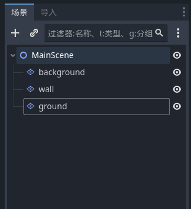  
*图 5-10：三层 TileMapLayer 分别负责背景、墙壁和地面*

**三层 TileMapLayer 的作用：**

| 节点名 | 用途 | 是否需要碰撞 |
|--------|------|------------|
| `background` | 背景装饰瓦片，纯视觉 | 否 |
| `ground` | 地面，玩家可站立 | 否 |
| `wall` | 墙壁，玩家和子弹无法穿过 | 是（第 1 层 world） |

**操作步骤：**
1. 选中 `MainScene` 根节点，按 `Ctrl+A` 添加 `TileMapLayer`，命名为 `background`
2. 重复操作，再添加命名为 `wall` 的 `TileMapLayer`
3. 再次添加命名为 `ground` 的 `TileMapLayer`
4. 选中每个节点，在检视器 `Tile Set` 字段中新建瓦片集 `或者` 直接使用 `tile_map.tres` 作为 `Tile Set`(tile_map.tres已经完成了后续所有 `TileSet` 的设置，可以直接使用)

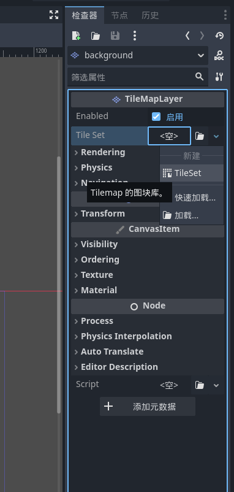  
*图 5-11：使用 TileMapLayer 创建 tileset*

**检视器关键属性：**

| 节点 | `Collision Layer` | `Collision Mask` |
|------|-------------------|------------------|
| `background` | 无 | 无 |
| `ground` | 无 | 无 |
| `wall` | 第 1 层（world） | 无 |

> **重要**：`wall` 的碰撞必须在 **TileSet 编辑器**中为每种瓦片手动绘制碰撞形状，否则角色会直接穿过地图。

> **提示**：在 Godot 中，节点的顺序即是绘制顺序，因此背景、墙壁、地面的顺序不能颠倒，否则可能会出现墙壁被背景覆盖的情况。后续节点添加也是如此。  
> 除了节点顺序，`Visibility` 属性也会影响绘制顺序，可以通过设置 `Visibility` 的属性实现高级的绘制顺序控制，此处按下不表。

5. 若为新建 `TileSet`，则在底部编辑器中，将左侧资源中的Tilemap Dungeon拖拽到 `TileSet` 中 

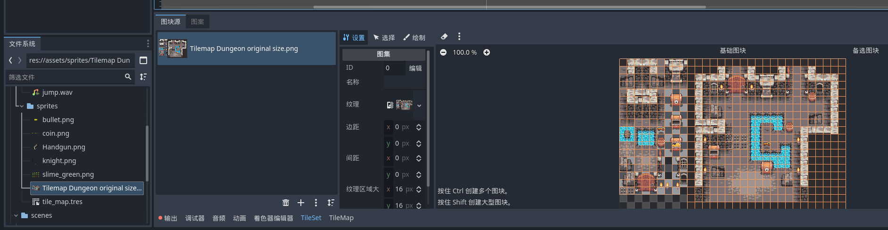
*图 5-12：正确导入tile_map_tres或者成功新建tileset后*

6. 现在，可以通过在底部选中`TileMap`界面进行基础的地图绘制

> 在底部右侧界面选中任意瓦片，再在屏幕中央点击，即可简单绘制地图

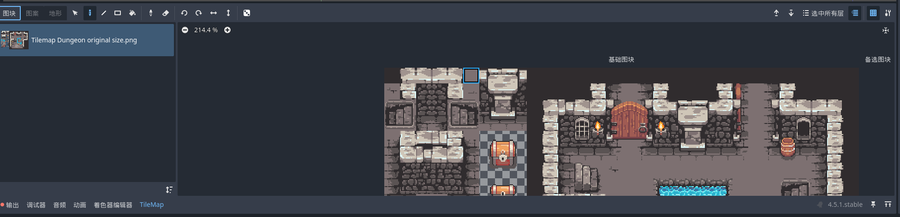
*图 5-13：使用 TileMap 进行基础地图绘制*

7. Godot 内置了地形功能，可以为瓦片集添加地形，更加方便的绘制地图

> 选中 `TileMapLayer` 节点，在屏幕右侧的检查器中点击已经新建的 `TileSet`，展开 `TileSet` 的属性  
> 找到`Terrain Sets`属性，点击`Terrain Sets`属性下的`添加元素`按钮，添加地形，然后再次点击内部的`添加元素`按钮，添加地形元素  
> 选择合适的颜色，建议选择和实际需要用到的瓦片对比较强的颜色

**提示**：`Terrain Sets` 属性需要添加两次元素才会成功创建地形，可以理解为先创建了大类，后创建小类。项目简单时，每次新建地形重新创建大类地形即可。

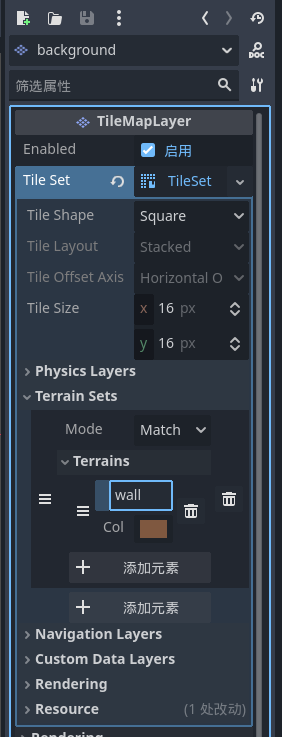  
*图 5-14：配置地形功能*

8. 在底部编辑器中配置地形

> 需要先将墙体底下的瓦片进行预处理，将墙顶和墙体的瓦片（纵向3个瓦片）设置为一个大瓦片  
> 可以先右键删除要设置为大瓦片的纵向3个瓦片（3组共9个小瓦片）  
> 按住`shift`，左键拖动选择纵向的3个瓦片，松开后即可自动合成为大瓦片

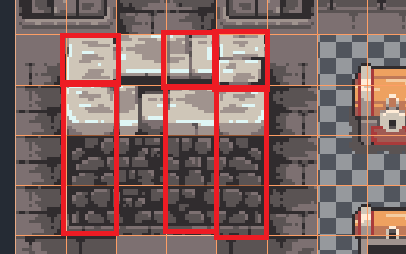
*图 5-15：设置纵向3个瓦片为一个大瓦片*

> 选中底部的 `TileSet` 界面在中间选择绘制（默认为设置）  
> 绘制属性中找到地形，在绘制中选择刚刚创建的地形（Terrain Set 0 -> wall）  
> 在右边绘制地形：先选中地形涵盖的瓦片，然后点击瓦片中间的部位，如下图所示  
> 下图中 高亮的瓦片 为选定的 地图涵盖的瓦片，中间的灰色方格为地形指示：  
> a. 该指示将单个瓦片重新划分为9个部分  
> b. 中心位置代表该瓦片自己的位置，周围8个位置代表相邻同地形瓦片的位置  
> c. 当以地形工具放下一个瓦片时，会检查相邻的8个位置，如果相邻位置有相同地形的瓦片，则会根据在地形设置中设置的规则，自动选择合适的瓦片放置 

> 例:
> 1. 若放置一个瓦片时，会选择从上至下第一排，从左至右第二个位置的瓦片，因为它仅绘制了中心一个点  
> 2. 若横向放置了3个瓦片，则会选择从上至下第二排，从左至右第三个位置的瓦片，因为它绘制了中心点和左右两个点（大瓦片仅在中心位置绘制）

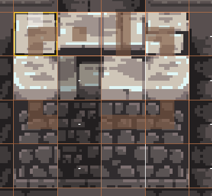
*图 5-16：设置地形*

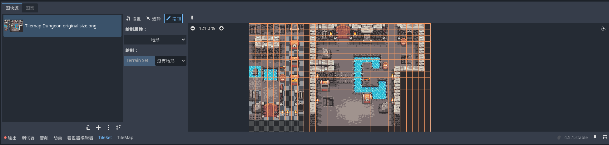  
*图 5-17：在底部 TileSet 编辑器中配置地形*

9. 为墙壁瓦片添加物理碰撞形状

> 现在右侧检查器中添加物理层（`Physics Layer`）
> 设置为第1层（world）

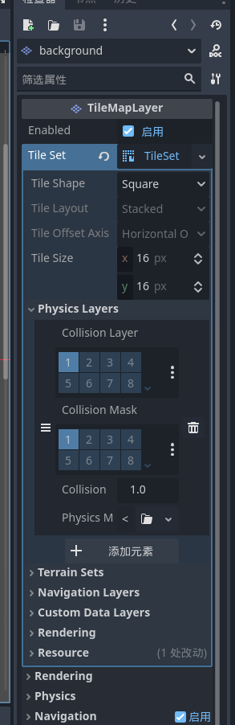
*图 5-18：在 TileSet 编辑器中添加物理层*

> 现在，可以在底部 TileSet 编辑器中打开绘制，选择`绘制属性` -> `物理` -> `物理层 0`  
> 选中墙体的瓦片，添加物理碰撞形状


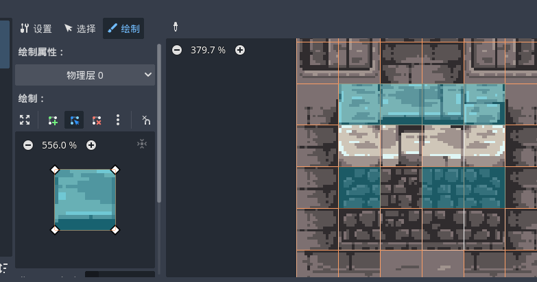
*图 5-19：在 TileSet 编辑器中为地面/墙壁瓦片添加物理碰撞形状*

> 现在你会发现合并的3个大墙体似乎并没有正确设置物理碰撞形状，它们仅有中间一个瓦片的碰撞形状  
> 现在，点击大瓦片，发现在左侧有预览图，在预览图中修改碰撞形状，使其与真正的边界吻合

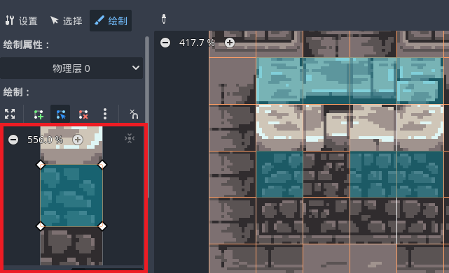
*图 5-20：设置大瓦片的物理碰撞形状*

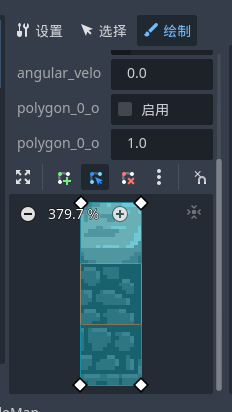  
*图 5-21：设置大瓦片的物理碰撞形状*

> 记得重新点击三个大瓦片以应用修改后的碰撞形状

10. 为瓦片添加随机波动

> 在绘制中，选择`渲染` -> `概率` 属性  
> 修改为任意你想要的概率值，然后点击对应的瓦片以应用
> 当你不希望地图太过单调时，可以使用概率以使绘制的地图增加随机性

**如何使用随机性**

在 `TileMap` 界面，按住`Shift`，左键点击选择多个瓦片，选择`随机放置图块`即可

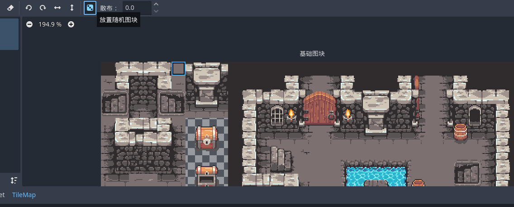
*图 5-22：随机放置图块*

11. 保存制作好的 `TileSet`（tile_map.tres）
> 回到右侧检查器，在我们新建TileSet的地方，点击右侧的向下箭头，展开选项，点击`保存为`，将tile_map.tres（或者另一个你喜欢的名字）保存在`res://assets/tileset`目录下（如果目录不存在，请自行创建）

12. 绘制你的地图

现在已经完成了 `TileSet` 的基本制作，可以选中底部的 `TileMap` 选项，开始绘制地图了

> 已经制作的地形可以在 `TileMap` 中的地图选项中选择

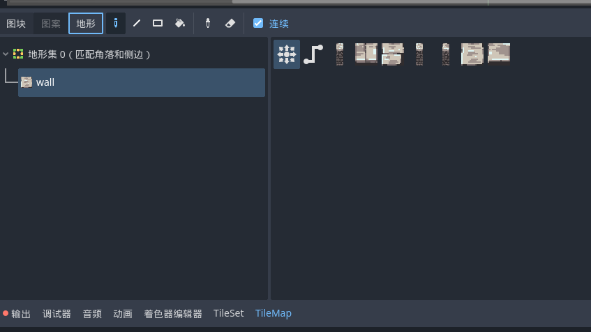
*图 5-23：使用 TileMap 地形选项进行地图绘制*

> 提示，记得分开绘制地图，不要将不同部分绘制在同一个地图中，可以更有效的管理地图

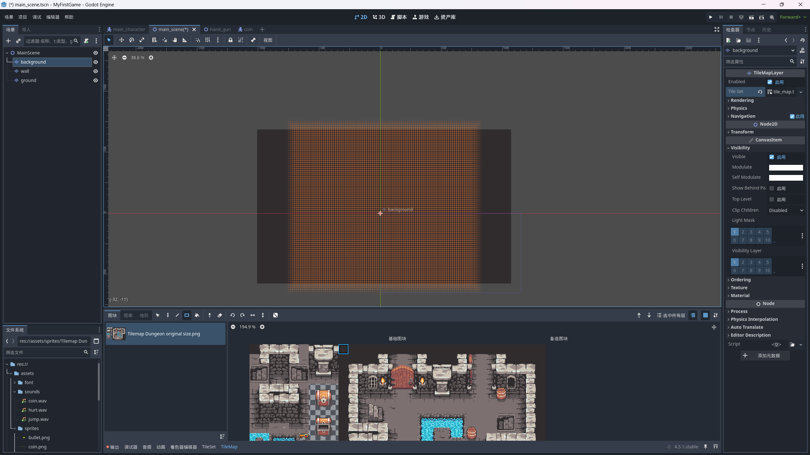  
*图 5-24：背景绘制*

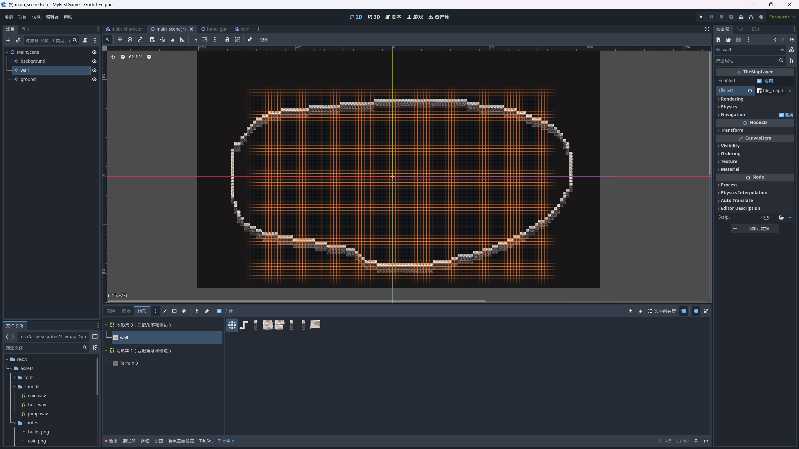  
*图 5-25：墙壁绘制*

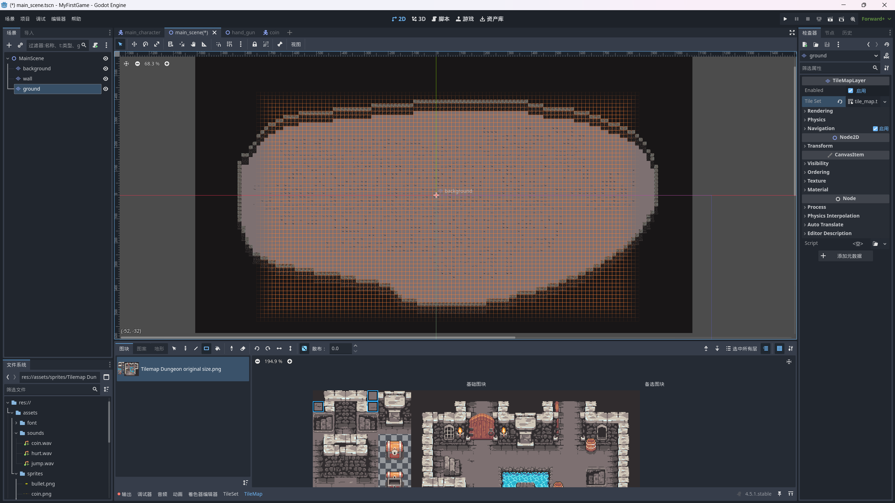  
*图 5-26：地面绘制*

---

### 5.13 步骤三：实例化玩家角色（MainCharacter）

**当前场景树状态：**
```
MainScene（Node2D）
├── background（TileMapLayer）
├── wall（TileMapLayer）
├── ground（TileMapLayer）
└── MainCharacter（main_character.tscn 实例）    ← ✅ 刚刚添加
```


**操作步骤：**
1. 在文件系统面板找到 `scenes/main_character.tscn`
2. 将其**拖拽到 2D 视口**中，场景树自动出现 `MainCharacter` 实例节点
3. 在 2D 视口中将玩家拖到地图的合适出生位置
---

### 5.14 步骤四：在地图中放置金币实例

**当前场景树状态：**
```
MainScene（Node2D）
├── background（TileMapLayer）
├── wall（TileMapLayer）
├── ground（TileMapLayer）
├── MainCharacter（main_character.tscn 实例）
│   └── Camera2D
└── coin × N（coin.tscn 实例）    ← ✅ 刚刚添加（可多个）
```

**操作步骤：**
1. 在文件系统面板找到 `scenes/coin.tscn`
2. 将其拖拽到 2D 视口中，每次拖入创建一个独立金币实例
3. 重复操作，在地图各处放置合适数量的金币

> **💡 提示**：选中已放置的金币实例，按 `Ctrl+D` 快速原地复制，再拖动到新位置。

---

### 5.15 步骤五：添加 UI（CanvasLayer）

**当前场景树状态：**
```
MainScene（Node2D）
├── background（TileMapLayer）
├── wall（TileMapLayer）
├── ground（TileMapLayer）
├── MainCharacter（main_character.tscn 实例）
│   └── Camera2D
├── coin × N（coin.tscn 实例）
├── DeathScreen（CanvasLayer）     ← ✅ 刚刚添加
├── PauseMenu（CanvasLayer）       ← ✅ 刚刚添加
├── VictoryScreen（CanvasLayer）   ← ✅ 刚刚添加
└── CoinHUD（CanvasLayer）         ← ✅ 刚刚添加
```

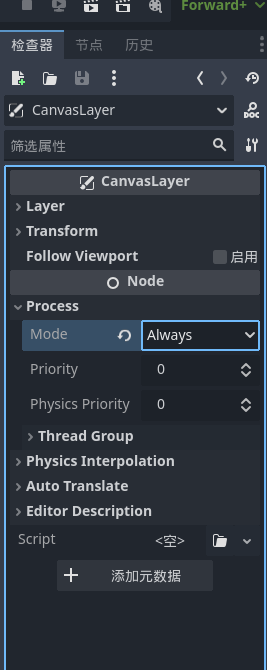  
*图 5-27：CanvasLayer 的 Process Mode 设为 Always，暂停时按钮仍可响应*

**为什么需要 CanvasLayer？**

`CanvasLayer` 是独立于游戏世界的 UI 层：
- **不随摄像机移动**：UI 始终固定在屏幕上
- **`Process Mode = ALWAYS`**：游戏暂停时 UI 仍可响应按钮点击

**四个 CanvasLayer 的用途：**

| 节点名 | 用途 | 触发条件 |
|--------|------|---------|
| `DeathScreen` | 死亡界面（含重生按钮） | 玩家 HP 归零 |
| `PauseMenu` | 暂停菜单（含音量、退出） | 按 Pause 键 |
| `VictoryScreen` | 胜利界面 | ⚠️ 本章暂无法触发（第六章加入史莱姆后生效） |
| `CoinHUD` | 金币计数 + 长按重置进度条 | 始终显示 |

**操作步骤：**
1. 选中 `MainScene` 根节点，按 `Ctrl+A` 添加 `CanvasLayer`，命名为 `DeathScreen`
2. 同样方法添加 `PauseMenu`、`VictoryScreen`、`CoinHUD`
3. 选中 `DeathScreen`、`PauseMenu`、`VictoryScreen`，在检视器中将 `Process Mode` 设为 `Always`
4. 在每个 CanvasLayer 内部添加对应的 UI 控件

**DeathScreen 内部结构（参考）：**
```
DeathScreen（CanvasLayer）
└── Center（CenterContainer）
    └── VBox（VBoxContainer）
        ├── Label（Label）            ← 提示文字
        └── RespawnButton（Button）    ← "重生"按钮
```

**PauseMenu 内部结构（参考）：**
```
PauseMenu（CanvasLayer）
└── Center（CenterContainer）
    └── VBox（VBoxContainer）
        ├── Label（Label）            ← 提示文字
        ├── Label2（Label）            ← 提示文字
        ├── RestartButton（Button）    ← "重新开始"按钮
        ├── QuitButton（Button）       ← "退出"按钮
        └── VolumeSlider（HSlider）    ← 音量滑块
```

**VictoryScreen 内部结构（参考）：**
```
VictoryScreen（CanvasLayer）
└── Center（CenterContainer）
    └── VBox（VBoxContainer）
        ├── Label（Label）            ← 提示文字
        ├── RestartButton（Button）    ← "再来一局"按钮
        └── QuitButton（Button）       ← "退出"按钮
```

**CoinHUD 内部结构（参考）：**
```
CoinHUD（CanvasLayer）
├── CoinLabel（Label）           ← 显示"硬币: 0"
└── ResetBar（ProgressBar）      ← 长按 R 键进度条（初始隐藏）
```

---

**为什么选用这些 UI 节点？**

> 下表解释了每种 UI 节点被选用的原因，帮助你理解 Godot UI 系统的设计思路。

| 节点类型 | 选用原因 |
|----------|----------|
| `CenterContainer` | 自动将子节点**居中对齐到父容器正中心**，无需手动计算坐标。用于把整个菜单框居中显示在屏幕中间，不需要写任何代码。 |
| `VBoxContainer` | **垂直方向自动排列**所有子节点，并在它们之间插入等间距。按钮和滑块从上到下整齐排成一列，新增或删除项目时排版自动调整，无需手动设置每个节点的 Y 坐标。 |
| `Button` | Godot 内置标准按钮控件，自带**点击检测、鼠标悬停状态和 `pressed` 信号**。点击时只需连接 `pressed` 信号就能触发函数，不需要自己写鼠标事件监听。 |
| `HSlider` | **水平滑块**，内置拖动手柄和 `value_changed` 信号，`value` 属性在 `min_value`~`max_value` 范围内自动变化。用于音量调节：将滑块值转换为分贝即可，比用两个按钮增减音量更直观自然。 |
| `Label` | 纯文字显示节点，修改 `text` 属性即可更新内容。`CoinLabel` 需要实时显示"硬币: 3"这类动态文字，`Label` 是最轻量的选择，不需要任何额外逻辑。 |
| `ProgressBar` | 内置**数值范围（`min_value` / `max_value`）与填充比例自动渲染**，只需设置 `value` 属性，进度条长度会自动更新。`ResetBar` 用来显示长按 R 键的蓄力进度，将 `value` 绑定到计时器变量即可，无需自己绘制矩形或计算百分比。 |

---


**检视器关键属性（每个 CanvasLayer）：**

| 属性 | 值 | 说明 |
|------|-----|------|
| `Layer` | `1` | UI 层级，数字越大越靠前显示 |
| `Process Mode` | `Always`（DeathScreen / PauseMenu / VictoryScreen） | 暂停时也能响应输入 |

 初始状态下，`DeathScreen`、`PauseMenu`、`VictoryScreen` 三个界面都应**设为隐藏**，由脚本在对应事件时显示；`CoinHUD` 始终可见。

---

### 5.15.1 制作死亡界面（DeathScreen）

> 死亡界面在玩家血量归零、死亡动画播放完毕后显示。它只有一个按钮：**重生**（即重载当前场景）。

*目标节点树：**
```
DeathScreen（CanvasLayer）
├── Overlay（ColorRect）          ← 半透明黑色遮罩，衬托菜单
└── Center（CenterContainer）     ← 自动居中整个菜单
    └── VBox（VBoxContainer）     ← 按钮纵向排列
        ├── Label（Label）            ← 提示文字
        └── RespawnButton（Button） ← "重生"按钮
```

#### 第一步：在 DeathScreen 内添加 Overlay（半透明遮罩）

**操作步骤：**
1. 在场景树中选中 `DeathScreen` 节点
2. 按 `Ctrl+A`，搜索 `ColorRect`，双击添加，重命名为 `Overlay`
3. 在检视器中设置以下属性：

| 属性 | 值 | 说明 |
|------|-----|------|
| `Layout` → `Anchors Preset` | `Full Rect`（铺满） | 让遮罩铺满整个屏幕 |
| `Color` | `Color(0, 0, 0, 0.5)` | 纯黑色，Alpha 设为 `0.5`（半透明） |

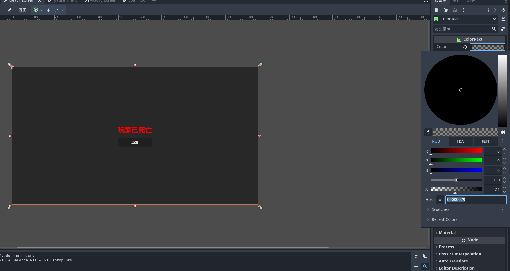
*图 5-28：将 ColorRect 的颜色设为半透明黑色（Alpha = 0.5），使背景游戏画面若隐若现*

> **💡 为什么用 ColorRect？**  
> `ColorRect` 是 Godot 中最轻量的**纯色矩形节点**，没有任何额外逻辑，只负责渲染一个颜色区域。将 `Color` 的 Alpha 设为 `0.5`，它就会变成一个**半透明遮罩**——既能让玩家感知到"游戏已暂停/结束"，又能透过遮罩依稀看到背景画面，视觉上比纯黑更自然。

> **💡 节点顺序很重要**：`Overlay` 必须排在 `Center` 的**前面**（上方），这样它会在场景树中先于 `Center` 渲染，即遮罩在底层、按钮菜单在顶层。在场景树中可通过拖动节点调整顺序。

---

#### 第二步：在 DeathScreen 内添加 CenterContainer

**操作步骤：**
1. 在场景树中选中 `DeathScreen` 节点
2. 按 `Ctrl+A`，搜索 `CenterContainer`，双击添加
3. 将节点重命名为 `Center`
4. **在检视器中设置锚点与大小**，使其铺满整个屏幕：

| 属性 | 值 | 说明 |
|------|----|------|
| `Layout` → `Anchors Preset` | `Full Rect`（铺满） | 点击检视器顶部的布局图标，选择"铺满整个父容器"，使菜单框始终覆盖整个游戏画面 |

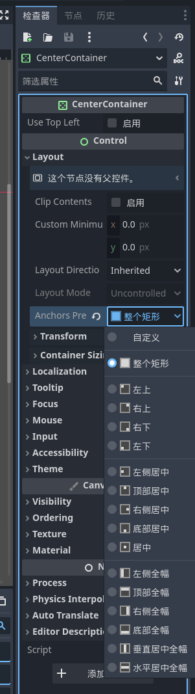  
*图 5-29：将 CenterContainer 的锚点预设设为「铺满」，使界面自动覆盖整个屏幕*

> **💡 为什么用 CenterContainer？**  
> 它会将内部的唯一子节点**自动对齐到自身的正中心**，无论屏幕分辨率如何变化，菜单始终显示在屏幕正中间，不需要手动计算 X/Y 坐标。

---

#### 第三步：在 Center 内添加 VBoxContainer

**操作步骤：**
1. 选中 `Center` 节点，按 `Ctrl+A` 添加 `VBoxContainer`，重命名为 `VBox`
2. 在检视器中设置子节点间距：

| 属性 | 建议值 | 说明 |
|------|--------|------|
| `Theme Overrides` → `Constants` → `Separation` |   `16`   | 子节点之间的垂直间距（像素），让按钮之间不会过于拥挤 |

> **💡 为什么用 VBoxContainer？**   
> 它会把所有子节点**从上到下依次排列**，并自动计算每个子节点的 Y 坐标。你只需添加按钮，不需要手动设置每个按钮的位置——之后增加或删除按钮时，间距也会自动调整。

---

#### 第四步：在 VBox 内添加 RespawnButton

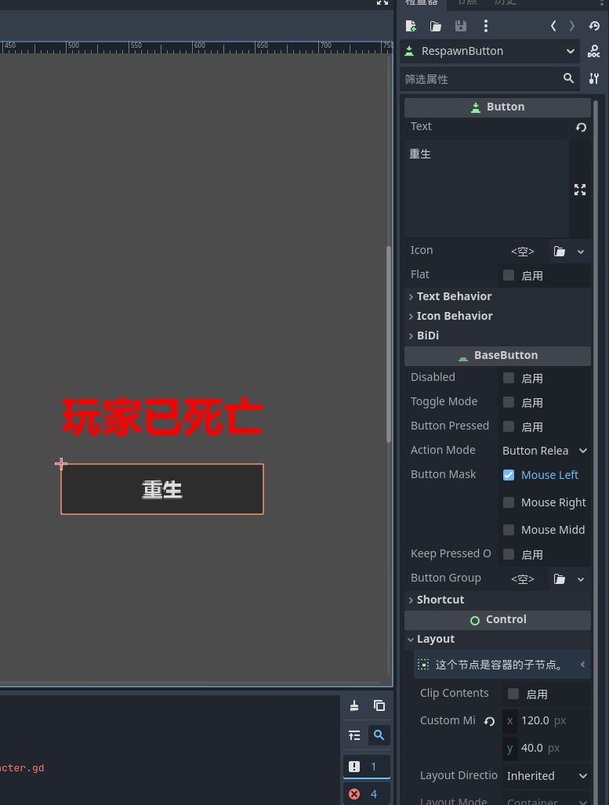
*图 5-30：添加 Button 并命名为 RespawnButton，修改显示文字为"重生"*

**操作步骤：**
1. 选中 `VBox` 节点，按 `Ctrl+A` 添加 `Label` 和 `Button`，重命名为 `DeathLabel` 和 `RespawnButton`
2. 在检视器中设置以下属性：

| 属性 | 建议值 | 说明 |
|------|--------|------|
| `Text` | `玩家已死亡` | label上的文字 |
| `Text` | `重生` | 按钮上显示的文字 |
| `Custom Minimum Size` | `Vector2(120, 40)` | 按钮的最小宽高（像素），防止按钮因文字过少而过小 |


> **💡 提示**：文字和按钮的外观样式（颜色、字体、圆角）可以通过检视器中的 `Theme Overrides` → `Styles` 来自定义，也可以先不管样式，功能做好后再美化。

---

#### 第五步：隐藏 DeathScreen（初始状态）

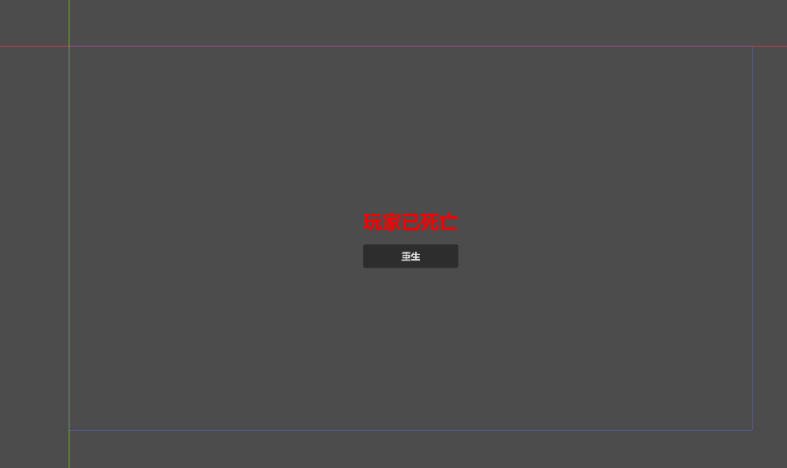
*图 5-31：死亡菜单场景*

**操作步骤：**
1. 选中 `DeathScreen` 节点
2. 在检视器顶部找到 `Layer` 区域，将 `Visible` 属性的勾选取消

> **💡 说明**：在编辑器中隐藏节点（`Visible = false`）只影响游戏运行时的初始状态。脚本中调用 `$DeathScreen.show()` 后它仍会正常显示。

---

### 5.15.2 制作暂停界面（PauseMenu）


> 暂停界面在玩家按下 `Escape` 键时显示，包含**重新开始**、**退出**按钮和一个**音量滑块**。

**目标节点树：**
```
PauseMenu（CanvasLayer）
├── Overlay（ColorRect）          ← 半透明黑色遮罩
└── Center（CenterContainer）
    └── VBox（VBoxContainer）
        ├── Label（Label）            ← 提示文字
        ├── Label2（Label）            ← 提示文字
        ├── VolumeSlider（HSlider）  ← 音量滑块
        ├── RestartButton（Button）   ← "重新开始"
        └── QuitButton（Button）      ← "退出"
```

#### 第一步：在 PauseMenu 内添加 Overlay（半透明遮罩）

操作与 5.15.1 第一步**完全相同**：
1. 选中 `PauseMenu`，按 `Ctrl+A` 搜索 `ColorRect`，双击添加，重命名为 `Overlay`
2. `Layout` → `Anchors Preset` 设为 `Full Rect`
3. `Color` 设为 `Color(0, 0, 0, 0.5)`（半透明黑色）

---

#### 第二步：添加 CenterContainer 和 VBoxContainer

操作与 5.15.1 中的前两步**完全相同**：
1. 选中 `PauseMenu`，按 `Ctrl+A` 添加 `CenterContainer`，重命名为 `Center`，锚点设为 `Full Rect`
2. 选中 `Center`，按 `Ctrl+A` 添加 `VBoxContainer`，重命名为 `VBox`，`Separation` 设为 `16`

---

#### 第三步：添加 RestartButton 和 QuitButton


**操作步骤：**
1. 选中 `VBox`，按 `Ctrl+A` 添加第一个 `Button`，重命名为 `RestartButton`
   - `Text` → `重新开始`
   - `Custom Minimum Size` → `Vector2(120, 40)`
2. 再次选中 `VBox`，按 `Ctrl+A` 添加第二个 `Button`，重命名为 `QuitButton`
   - `Text` → `退出`
   - `Custom Minimum Size` → `Vector2(120, 40)`

> **💡 提示**：两个按钮都在 `VBox` 下，`VBoxContainer` 会自动将它们从上到下排列，无需手动设置 Y 坐标。

---

#### 第四步：添加 VolumeSlider（音量滑块）


**操作步骤：**
1. 选中 `VBox`，按 `Ctrl+A` 添加 `HSlider`，重命名为 `VolumeSlider`
2. 在检视器中设置以下属性：

| 属性 | 建议值 | 说明 |
|------|--------|------|
| `Min Value` | `0.0` | 音量最小值（0 = 静音） |
| `Max Value` | `1.0` | 音量最大值（1 = 原始音量） |
| `Value` | `1.0` | 默认音量为最大 |
| `Step` | `0.01` | 每次拖动的精度 |
| `Custom Minimum Size` | `Vector2(120, 20)` | 滑块的最小宽高 |

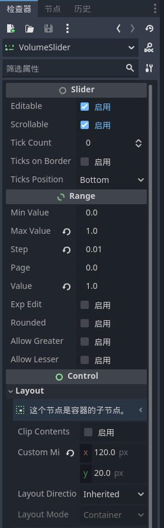  
*图 5-32：音量滑块的属性设置，数值范围 0.0 ~ 1.0 对应静音到最大音量*

> **💡 为什么用 HSlider？**  
> `HSlider`（水平滑块）内置了**拖动手柄和 `value_changed` 信号**，当用户拖动滑块时自动触发信号并传入当前值。相比用两个"音量+"/"音量-"按钮，滑块的操作更直观，且代码更简洁——只需连接一个信号即可。

---

#### 第五步：隐藏 PauseMenu（初始状态）

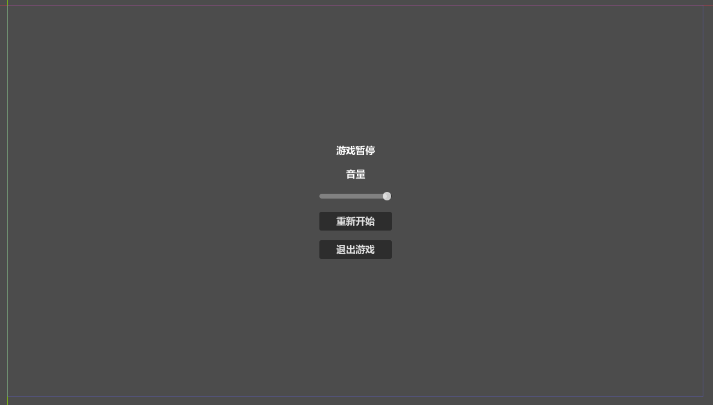
*图 5-33：暂停菜单场景*

与 5.15.1 第五步相同：选中 `PauseMenu`，在检视器中将 `Visible` 取消勾选。

---

### 5.15.3 制作胜利界面（VictoryScreen）

> 胜利界面在所有史莱姆被消灭后显示（本章暂无法触发，第六章完成后生效）。结构与暂停界面相似，但没有音量滑块。

**目标节点树：**
```
VictoryScreen（CanvasLayer）
├── Overlay（ColorRect）          ← 半透明黑色遮罩
└── Center（CenterContainer）
    └── VBox（VBoxContainer）
        ├── Label（Label）            ← 提示文字
        ├── RestartButton（Button）  ← "再来一局"
        └── QuitButton（Button）    ← "退出"
```

#### 第一步：在 VictoryScreen 内添加 Overlay（半透明遮罩）

操作与 5.15.1 第一步**完全相同**：
1. 选中 `VictoryScreen`，按 `Ctrl+A` 搜索 `ColorRect`，双击添加，重命名为 `Overlay`
   - `Layout` → `Anchors Preset` → `Full Rect`
   - `Color` → `Color(0, 0, 0, 0.5)`（半透明黑色）

---

#### 第二步：添加 CenterContainer 和 VBoxContainer

操作与 5.15.1 中的前两步**完全相同**：
1. 选中 `VictoryScreen`，按 `Ctrl+A` 添加 `CenterContainer`，重命名为 `Center`，锚点设为 `Full Rect`
2. 选中 `Center`，按 `Ctrl+A` 添加 `VBoxContainer`，重命名为 `VBox`，`Separation` 设为 `16`

---

#### 第三步：添加 RestartButton 和 QuitButton

1. 选中 `VBox`，按 `Ctrl+A` 添加第一个 `Button`，重命名为 `RestartButton`
   - `Text` → `再来一局`
   - `Custom Minimum Size` → `Vector2(120, 40)`
2. 再次选中 `VBox`，按 `Ctrl+A` 添加第二个 `Button`，重命名为 `QuitButton`
   - `Text` → `退出`
   - `Custom Minimum Size` → `Vector2(120, 40)`

---

#### 第四步：隐藏 VictoryScreen（初始状态）

与 5.15.1 第五步相同：选中 `VictoryScreen`，在检视器中将 `Visible` 取消勾选（初始隐藏）

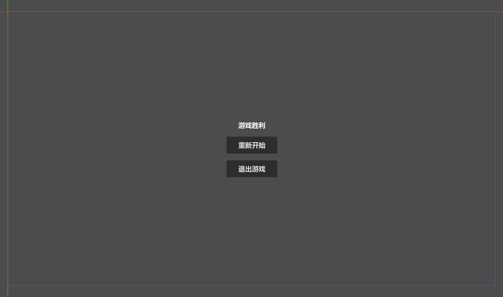
*图 5-34：胜利菜单场景*（本章暂无法触发，第六章完成后生效）

> **⚠️ 注意**：本章中 `VictoryScreen` 不会显示，因为还没有史莱姆。完成第六章制作史莱姆后，在 `main_scene.gd` 的 `_ready()` 中取消 `# call_deferred("_connect_slimes")` 的注释，胜利界面才会生效。

---

### 5.15.4 制作金币计数界面（CoinHUD）

> `CoinHUD` 始终显示在屏幕左上角，包含两个元素：**金币数量文字**和**长按 R 键的重置进度条**（进度条平时隐藏，按住 R 键时才出现）。

**目标节点树：**
```
CoinHUD（CanvasLayer）
├── CoinLabel（Label）       ← 显示"硬币: 0"
└── ResetBar（ProgressBar）  ← 长按 R 键的蓄力进度（初始隐藏）
```

> **💡 为什么 CoinHUD 不用 CenterContainer？**  
> 金币计数需要固定在屏幕**左上角**，而非屏幕中央，所以直接将 `CoinLabel` 和 `ResetBar` 放在 `CoinHUD` 下，手动设置它们的 `Position` 来精确定位。

---

#### 第一步：添加 CoinLabel

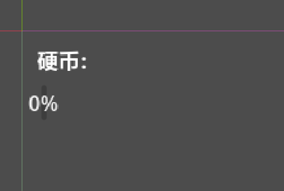  
*图 5-35：CoinLabel 固定在屏幕左上角，随时显示当前金币数量*

**操作步骤：**
1. 选中 `CoinHUD` 节点，按 `Ctrl+A` 添加 `Label`，重命名为 `CoinLabel`
2. 在检视器中设置以下属性：

| 属性 | 建议值 | 说明 |
|------|--------|------|
| `Text` | `硬币: 0` | 初始文字，脚本运行后会动态更新 |

> **💡 为什么用 Label？**  
> `Label` 是 Godot 中**最轻量的文字显示节点**，修改 `text` 属性即可更新显示内容。`CoinLabel` 只需要实时显示"硬币: 3"这样的动态数字，不需要点击交互，`Label` 是最合适的选择。

---

#### 第二步：添加 ResetBar（重置进度条）


**操作步骤：**
1. 选中 `CoinHUD` 节点，按 `Ctrl+A` 添加 `ProgressBar`，重命名为 `ResetBar`
2. 在检视器中设置以下属性：

| 属性 | 建议值 | 说明 |
|------|--------|------|
| `Min Value` | `0.0` | 进度最小值，对应"没有按下 R" |
| `Max Value` | `1.0` | 进度最大值，对应"按满 1 秒重置" |
| `Value` | `0.0` | 初始进度为 0 |
| `Show Percentage` | `false`（取消勾选） | 不显示百分比文字，只显示色块 |
| `Position` | \ | 位于 CoinLabel 正下方 |
| `Size` | `Vector2(100, 8)` | 进度条宽 100 像素，高 8 像素 |
| `Visible` | `false`（取消勾选） | **初始隐藏**，按 R 键时由脚本显示 |

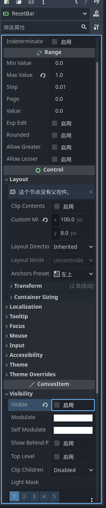  
*图 5-36：ResetBar 的属性设置，注意 Show Percentage 关闭、Visible 初始关闭*

> **💡 为什么用 ProgressBar？**  
> `ProgressBar` 内置了 `min_value` / `max_value` 的数值范围，以及**填充比例的自动渲染**——只需每帧更新 `value` 属性，进度条的视觉长度会自动变化，不需要自己用代码绘制矩形或计算百分比。

---

#### 当前 CoinHUD 完整状态确认

```
CoinHUD（CanvasLayer）
├── CoinLabel（Label）      ← Visible=true，Text="硬币: 0"
└── ResetBar（ProgressBar） ← Visible=false，Min=0，Max=1
```

> **💡 快速定位技巧**：在 2D 视口中选中 `CoinHUD` 的子节点，按 `F` 键可以让视口快速缩放并定位到该节点所在位置，方便检查实际显示效果。

---

### 5.16 完整场景确认（main_scene.tscn）

```
MainScene（Node2D）
├── background（TileMapLayer）                   ← 背景装饰层
├── wall（TileMapLayer）                          ← 墙壁碰撞层
├── ground（TileMapLayer）                        ← 地面碰撞层
├── MainCharacter（main_character.tscn 实例）     ← 玩家角色
│   └── Camera2D                                 ← 跟随玩家的镜头
├── coin × N（coin.tscn 实例）                    ← N 枚金币
├── DeathScreen（CanvasLayer）                    ← 死亡界面
├── PauseMenu（CanvasLayer）                      ← 暂停菜单
├── VictoryScreen（CanvasLayer）                  ← 胜利界面（暂无法触发）
└── CoinHUD（CanvasLayer）                        ← 金币计数与重置条
```

> ⚠️ **注意**：此时场景中没有史莱姆，`VictoryScreen` 不会显示。完成**第六章**制作史莱姆并放入主场景、在脚本 `_ready()` 中取消注释 `call_deferred("_connect_slimes")` 后，胜利条件才能生效。

> ⚠️ **注意**：请确保制作的4个特殊场景都已保存为.tscn文件，可以采用拖拽的方式加入主场景中。


---

### 5.17 附加脚本（main_scene.gd）函数说明

**操作步骤：**
1. 选中根节点 `MainScene`，右键 → `创建脚本`，保存为 `scripts/main_scene.gd`
2. 点击 `创建`，脚本编辑器自动打开

```gdscript
extends Node2D

var coin_count       := 0
var reset_hold_timer := 0.0
```

---

#### `_ready()` — 场景初始化

```gdscript
func _ready() -> void:

	# 主场景根节点本身也设为 Always，确保暂停时仍能接收 _unhandled_input 事件
	process_mode                 = PROCESS_MODE_ALWAYS
    
	# 将游戏世界节点设为可暂停（暂停时停止运行）
	$background.process_mode    = PROCESS_MODE_PAUSABLE
	$wall.process_mode          = PROCESS_MODE_PAUSABLE
	$ground.process_mode        = PROCESS_MODE_PAUSABLE
	$MainCharacter.process_mode = PROCESS_MODE_PAUSABLE

	# 确保所有 UI 层在游戏暂停时仍可响应输入与按钮点击
	$DeathScreen.process_mode    = PROCESS_MODE_ALWAYS
	$PauseMenu.process_mode      = PROCESS_MODE_ALWAYS
	$VictoryScreen.process_mode  = PROCESS_MODE_ALWAYS
	$CoinHUD.process_mode        = PROCESS_MODE_ALWAYS

	# 初始隐藏所有覆盖界面
	$DeathScreen.hide()
	$PauseMenu.hide()
	$VictoryScreen.hide()

	# 连接玩家死亡信号
	$MainCharacter.died.connect(_on_player_died)

	# 连接按钮悬停动画
	_setup_button($DeathScreen/Center/VBox/RespawnButton)
	_setup_button($PauseMenu/Center/VBox/RestartButton)
	_setup_button($PauseMenu/Center/VBox/QuitButton)
	_setup_button($VictoryScreen/Center/VBox/RestartButton)
	_setup_button($VictoryScreen/Center/VBox/QuitButton)

	# 连接按钮点击事件
	$DeathScreen/Center/VBox/RespawnButton.pressed.connect(_on_respawn_pressed)
	$PauseMenu/Center/VBox/RestartButton.pressed.connect(_on_restart_pressed)
	$PauseMenu/Center/VBox/QuitButton.pressed.connect(_on_quit_pressed)
	$VictoryScreen/Center/VBox/RestartButton.pressed.connect(_on_restart_pressed)
	$VictoryScreen/Center/VBox/QuitButton.pressed.connect(_on_quit_pressed)

	# 初始化音量滑块
	$PauseMenu/Center/VBox/VolumeSlider.value = db_to_linear(AudioServer.get_bus_volume_db(0))
	$PauseMenu/Center/VBox/VolumeSlider.value_changed.connect(_on_volume_changed)

	# 重置进度条初始隐藏
	$CoinHUD/ResetBar.hide()

	# 延迟连接金币信号（确保金币实例已加入 "coins" 组）
	call_deferred("_connect_coins")

	# ⚠️ 第六章完成后，取消下方注释即可启用胜利检测
	# call_deferred("_connect_slimes")
```

> `call_deferred("函数名")` 将函数调用推迟到本帧结束后执行，确保场景中所有节点完成 `_ready` 初始化后再批量连接信号。

---

#### `_process(delta)` — 长按 R 重置

```gdscript
func _process(delta: float) -> void:
	if Input.is_action_pressed("reset"):
		reset_hold_timer += delta
		$CoinHUD/ResetBar.show()
		$CoinHUD/ResetBar.value = reset_hold_timer
		if reset_hold_timer >= 1.0:
			reset_hold_timer = 0.0
			get_tree().paused = false
			get_tree().reload_current_scene()    # 长按满 1 秒：重载整个场景
	else:
		if reset_hold_timer > 0.0:
			reset_hold_timer = 0.0
			$CoinHUD/ResetBar.value = 0.0
			$CoinHUD/ResetBar.hide()
```

---

#### `_connect_coins()` 与 `_on_coin_collected()` — 金币计数

```gdscript
func _connect_coins() -> void:
	for coin in get_tree().get_nodes_in_group("coins"):
		if not coin.collected.is_connected(_on_coin_collected):
			coin.collected.connect(_on_coin_collected)


func _on_coin_collected() -> void:
	coin_count += 1
	$CoinHUD/CoinLabel.text = "硬币: %d" % coin_count
```

> `_connect_coins()` 遍历所有处于 "coins" 组的金币节点，逐一连接 `collected` 信号。每次拾取金币，计数器加一并更新 HUD 显示。

---

#### `_unhandled_input(event)` — 暂停键处理

```gdscript
func _unhandled_input(event: InputEvent) -> void:
	if event.is_action_pressed("pause"):
		if $PauseMenu.visible:
			_resume()
		elif not $DeathScreen.visible and not $VictoryScreen.visible:
			_show_pause_menu()
```

> `_unhandled_input` 只在事件未被 UI 控件（如按钮）处理时才触发，避免按钮点击被误判为暂停操作。

---

#### 死亡 / 暂停 / 重生 / 重启 / 退出辅助函数

```gdscript
func _on_player_died() -> void:
	get_tree().paused = true
	$DeathScreen.show()


func _show_pause_menu() -> void:
	get_tree().paused = true
	$PauseMenu.show()


func _resume() -> void:
	get_tree().paused = false
	$PauseMenu.hide()


func _on_respawn_pressed() -> void:
	get_tree().paused = false
	get_tree().reload_current_scene()


func _on_restart_pressed() -> void:
	get_tree().paused = false
	get_tree().reload_current_scene()


func _on_quit_pressed() -> void:
	get_tree().quit()
```

> `get_tree().paused = true` 会暂停所有 `Process Mode = Pausable` 的节点（地图、玩家），而 `CanvasLayer` 中 `Process Mode = Always` 的 UI 节点仍可响应按钮。

---

#### `_on_volume_changed(value)` — 音量调节

```gdscript
func _on_volume_changed(value: float) -> void:
	var db := linear_to_db(value) if value > 0.0 else -80.0
	AudioServer.set_bus_volume_db(0, db)
```

> 人耳对音量的感知是对数关系，`linear_to_db()` 完成线性→对数转换，使音量滑块拖动感受更自然。

---

#### 胜利逻辑（第六章完成史莱姆后启用）

```gdscript
func _connect_slimes() -> void:
	for slime in get_tree().get_nodes_in_group("slimes"):
		if not slime.tree_exited.is_connected(_on_slime_removed):
			slime.tree_exited.connect(_on_slime_removed)


func _on_slime_removed() -> void:
	if not is_inside_tree(): return
	if get_tree().get_nodes_in_group("slimes").is_empty():
		_show_victory()


func _show_victory() -> void:
	get_tree().paused = true
	$VictoryScreen.show()
```

> **启用步骤**：完成第六章后，在主场景中放入史莱姆实例，然后在 `_ready()` 中取消 `# call_deferred("_connect_slimes")` 的注释即可。现在将这三个函数写入脚本不会产生任何错误（组为空时循环体不执行）。

---

#### 按钮悬停动画

```gdscript
func _setup_button(button: Button) -> void:
	button.mouse_entered.connect(_on_button_hover.bind(button))
	button.mouse_exited.connect(_on_button_unhover.bind(button))


func _on_button_hover(button: Button) -> void:
	button.pivot_offset = button.size / 2.0
	var tween := create_tween().set_parallel(true)
	tween.tween_property(button, "scale",    Vector2(1.2, 1.2),    0.12)
	tween.tween_property(button, "modulate", Color(1.5, 1.5, 1.5), 0.12)


func _on_button_unhover(button: Button) -> void:
	button.pivot_offset = button.size / 2.0
	var tween := create_tween().set_parallel(true)
	tween.tween_property(button, "scale",    Vector2(1.0, 1.0),    0.12)
	tween.tween_property(button, "modulate", Color(1.0, 1.0, 1.0), 0.12)
```

---

### 5.18 制作开始菜单场景（start.tscn）

> 开始菜单是玩家打开游戏后看到的第一个画面，包含**开始游戏**和**退出**两个按钮。它是一个独立场景，通过切换场景的方式跳转到游戏主场景。

**本节结束后，你将拥有如下节点树：**

```
StartMenu（Control）              ← 根节点，负责整个 UI 布局
└── VBoxContainer                 ← 垂直排列两个按钮
    ├── StartButton（Button）     ← "开始游戏" 按钮
    └── QuitButton（Button）      ← "退出" 按钮
```

---

#### 第一步：创建空白场景文件

**操作步骤：**
1. 点击工作区标签栏 `+` 新建场景
2. 按 `Ctrl+S` 保存，命名为 `start.tscn`，保存到 `scenes/` 目录

---

#### 第二步：添加根节点 Control

**当前场景树状态：**
```
StartMenu（Control）    ← ✅ 刚刚添加
```


**为什么选 Control？**

`Control` 是 Godot 中所有 UI 节点的基类，专门为 2D 界面设计，内置了**锚点（Anchor）、边距（Margin）和布局系统**，能让 UI 自动适应不同分辨率。开始菜单只需要展示按钮，不需要物理能力，因此 `Control` 是最合适的根节点类型。

**操作步骤：**
1. 在空白场景树中点击 `其他节点`，搜索 `Control`，双击创建
2. 将节点重命名为 `StartMenu`
3. 在检视器中将 `Layout` → `Anchors Preset` 设为 `Full Rect`（铺满屏幕）
4. 按 `Ctrl+S` 保存

---

#### 第三步：添加 VBoxContainer（垂直布局容器）

**当前场景树状态：**
```
StartMenu（Control）
└── VBoxContainer    ← ✅ 刚刚添加
```


**为什么选 VBoxContainer？**

`VBoxContainer` 会自动将子节点**从上到下垂直排列**，并统一控制间距。添加或删除按钮时无需手动调整每个节点的 Y 坐标，排版自动更新。

**操作步骤：**
1. 选中 `StartMenu`，按 `Ctrl+A` 添加 `VBoxContainer`
2. 在检视器中设置以下属性：

| 属性 | 建议值 | 说明 |
|------|--------|------|
| `Layout` → `Layout Mode` → `Anchors` → `Anchors Preset` | `Center`（居中） | 让整个按钮组始终显示在屏幕正中央 |
| `Theme Overrides` → `Constants` → `Separation` | `16` | 两个按钮之间的垂直间距（像素） |

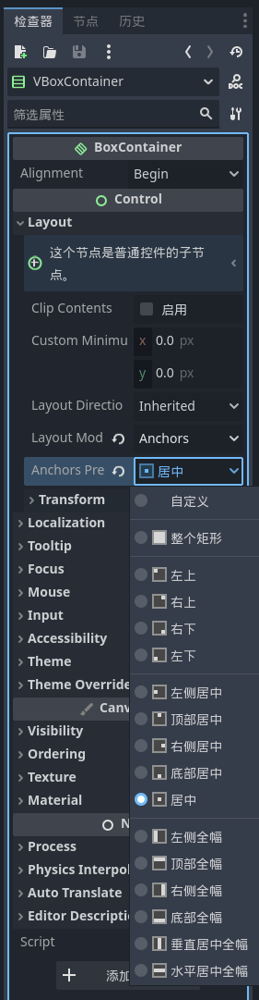  
*图 5-37：将 VBoxContainer 的锚点设为居中，菜单始终出现在屏幕中间*

---

#### 第四步：添加 StartButton 和 QuitButton

**当前场景树状态：**
```
StartMenu（Control）
└── VBoxContainer
    ├── StartButton（Button）   ← ✅ 刚刚添加
    └── QuitButton（Button）    ← ✅ 刚刚添加
```
**与前文增加按钮相同**：

**操作步骤：**
1. 选中 `VBoxContainer`，按 `Ctrl+A` 添加 `Button`，命名为 `StartButton`
   - 检视器 `Text` → `开始游戏`
   - 检视器 `Custom Minimum Size` → `Vector2(140, 45)`
2. 再次选中 `VBoxContainer`，按 `Ctrl+A` 添加第二个 `Button`，命名为 `QuitButton`
   - 检视器 `Text` → `退出`
   - 检视器 `Custom Minimum Size` → `Vector2(140, 45)`


> **💡 提示**：`Custom Minimum Size` 设置按钮的最小宽高，防止按钮因文字过少而显得太小，影响点击体验。

---

#### 第五步：附加脚本（start_menu.gd）

**操作步骤：**
1. 选中根节点 `StartMenu`
2. 右键 → `创建脚本`，保存路径设为 `scripts/start_menu.gd`
3. 点击 `创建`，脚本编辑器自动打开

---

##### `_ready()` — 初始化

```gdscript
extends Control

func _ready() -> void:
	var start_btn := $VBoxContainer/StartButton as Button  # 获取开始按钮引用
	var quit_btn  := $VBoxContainer/QuitButton  as Button  # 获取退出按钮引用

	# 为两个按钮连接悬停动画信号
	start_btn.mouse_entered.connect(_on_button_hover.bind(start_btn))
	start_btn.mouse_exited.connect(_on_button_unhover.bind(start_btn))
	start_btn.pressed.connect(_on_start_pressed)           # 点击开始按钮

	quit_btn.mouse_entered.connect(_on_button_hover.bind(quit_btn))
	quit_btn.mouse_exited.connect(_on_button_unhover.bind(quit_btn))
	quit_btn.pressed.connect(_on_quit_pressed)             # 点击退出按钮
```

> `as Button` 是**类型转换**语法，告诉 Godot 这个节点的类型是 `Button`，这样代码补全时能看到 Button 的所有属性和方法。

---

##### 按钮悬停动画

```gdscript
func _on_button_hover(button: Button) -> void:
	button.pivot_offset = button.size / 2.0       # 将缩放中心设为按钮中央
	var tween := create_tween().set_parallel(true) # 多个属性同时播放动画
	tween.tween_property(button, "scale",    Vector2(1.2, 1.2),    0.12)  # 放大到 1.2 倍
	tween.tween_property(button, "modulate", Color(1.5, 1.5, 1.5), 0.12)  # 变亮


func _on_button_unhover(button: Button) -> void:
	button.pivot_offset = button.size / 2.0
	var tween := create_tween().set_parallel(true)
	tween.tween_property(button, "scale",    Vector2(1.0, 1.0),    0.12)  # 恢复原始大小
	tween.tween_property(button, "modulate", Color(1.0, 1.0, 1.0), 0.12)  # 恢复原始亮度
```

> `Tween` 是 Godot 内置的**补间动画系统**，`tween_property(节点, "属性名", 目标值, 时长)` 会在指定时间内平滑地将属性从当前值过渡到目标值。`set_parallel(true)` 让多个属性**同时**播放，否则会依次播放。

---

##### 按钮点击回调

```gdscript
func _on_start_pressed() -> void:
	get_tree().change_scene_to_file("res://scenes/main_scene.tscn")  # 切换到游戏主场景


func _on_quit_pressed() -> void:
	get_tree().quit()  # 退出游戏
```

> `change_scene_to_file()` 会卸载当前场景（开始菜单）并加载目标场景（主场景），整个过程由 Godot 自动管理内存，不需要手动释放节点。

---

### 5.19 设置游戏主场景

所有场景和功能制作完成后，需要告诉 Godot 游戏**从哪个场景开始运行**（即按 `F5` 时启动哪个场景）。


**操作步骤：**
1. 右键左下角文件系统中的 `start_menu.tscn` 文件
3. 点击`设置为主场景`

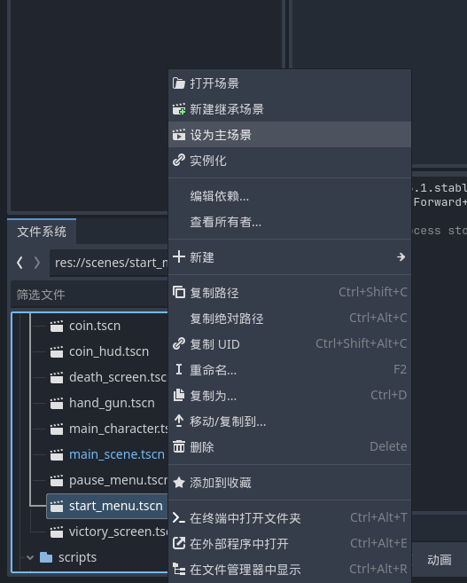  
*图 5-38：设置主场景后，点击 F5 将从开始菜单启动*

设置完成后，按 `F5` 运行项目将从开始菜单（`start_menu.tscn`）启动，而非直接进入游戏场景。

---


## 第六章：史莱姆敌人场景（slime.tscn）

> 史莱姆是本游戏的唯一敌人，它会追踪玩家、蓄力冲锋，并在受伤/死亡时播放音效和动画。本章将从空白场景出发，逐步搭建史莱姆的完整节点树。

**本章结束后，你将拥有如下完整节点树：**
```
slime（CharacterBody2D）
├── AnimatedSprite2D
├── CollisionShape2D
├── Hitbox（Area2D）
│   └── CollisionShape2D
├── HurtSound（AudioStreamPlayer）
└── JumpSound（AudioStreamPlayer）
```

---

### 6.1 创建空白场景文件

1. 在文件系统面板右键 `scenes/` → `新建场景`
2. 此时场景树完全空白——不含任何节点
3. 按 `Ctrl+S` 保存，命名为 `slime.tscn`

**当前场景树状态：**
```
（空）
```

---

### 6.2 步骤一：添加根节点 CharacterBody2D

**当前场景树状态：**
```
slime（CharacterBody2D）    ← ✅ 刚刚添加
```


**为什么使用 CharacterBody2D？**

与玩家角色相同，史莱姆也需要物理移动（追踪、冲锋、碰墙反弹），使用 `CharacterBody2D` 可以调用 `move_and_slide()` 进行带碰撞的移动。

**操作步骤：**
1. 在场景树顶部点击 `其他节点`，搜索 `CharacterBody2D`，双击创建
2. 在场景树中将该节点重命名为 `slime`
3. 在检视器中设置碰撞层

**检视器关键属性：**

| 属性 | 值 | 说明 |
|------|-----|------|
| `Collision Layer` | 第 3 层（slime） | 史莱姆自身所在的层 |
| `Collision Mask` | 第 1 层（world）+ 第 2 层（player） | 与地图和玩家产生物理碰撞 |

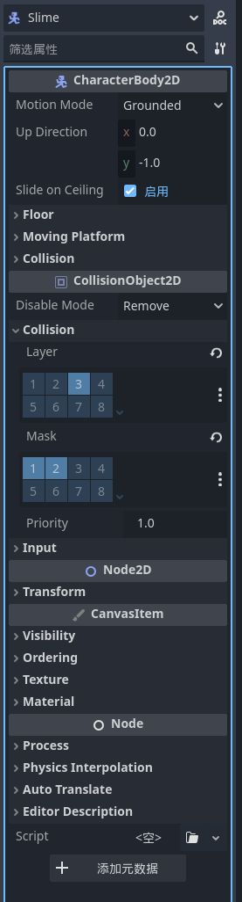   
*图 6-1：史莱姆碰撞设置*

---

### 6.3 步骤二：添加 AnimatedSprite2D（史莱姆动画）

**当前场景树状态：**
```
slime（CharacterBody2D）
└── AnimatedSprite2D        ← ✅ 刚刚添加
```

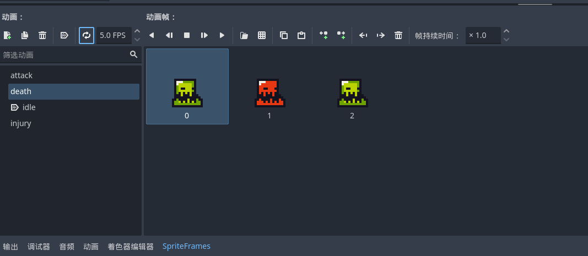
*图 6-2：史莱姆有 4 种动画，death 动画播完后节点将被删除*

**为什么需要 AnimatedSprite2D？**

史莱姆有多种行为状态（待机（移动）、攻击、受伤、死亡），每种状态对应不同动画，`AnimatedSprite2D` 负责在这些动画之间切换。

**操作步骤：**
1. 选中 `slime` 根节点，按 `Ctrl+A` 添加 `AnimatedSprite2D`
2. 在检视器 `Sprite Frames` 中点击 `新建 SpriteFrames`，导入史莱姆图片
3. 创建以下动画并导入对应帧：

| 动画名 | 是否循环 | 说明 |
|--------|----------|------|
| `idle` | ✅ 循环 | 站立待机 |
| `attack` | ✅ 循环 | 攻击移动 |
| `injury` | ❌ 不循环 | 受伤闪烁 |
| `death` | ❌ 不循环 | 死亡动画，播完后删除节点 |

> **💡 提示**：`death` 动画不循环，因为它播放完毕后脚本会调用 `queue_free()` 删除史莱姆节点。

**史莱姆动画模板**

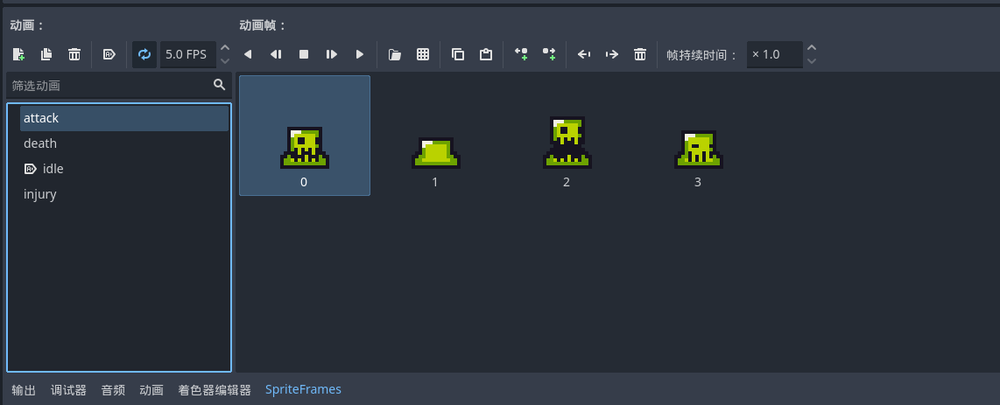
*图 6-3：史莱姆攻击动画*

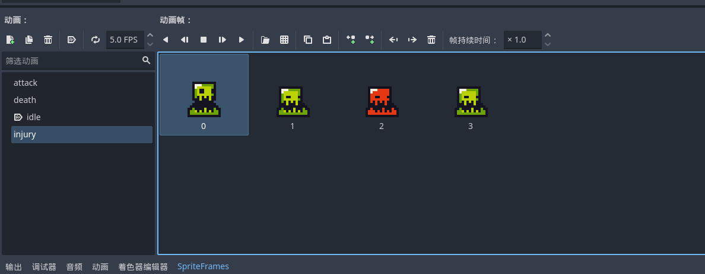  
*图 6-4：史莱姆受击动画*

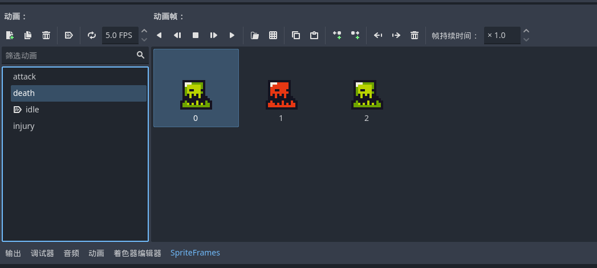  
*图 6-5：史莱姆死亡动画*

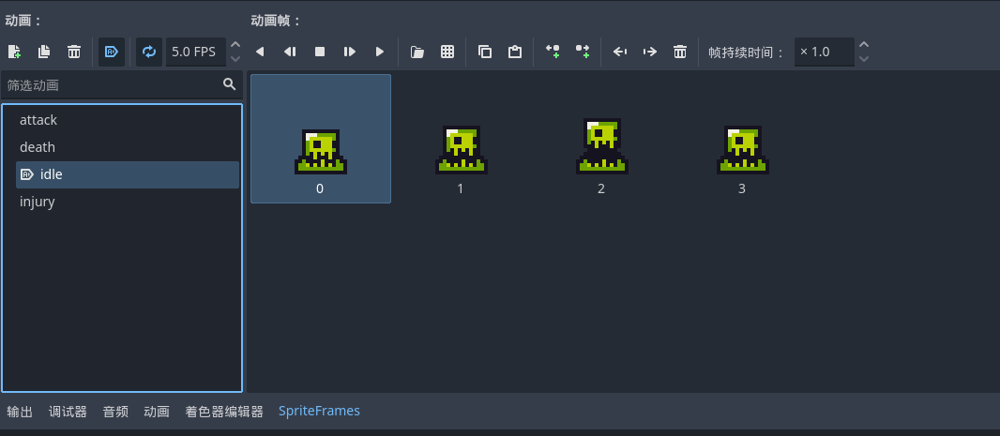
*图 6-6：史莱姆默认动画*

---

### 6.4 步骤三：添加 CollisionShape2D（身体碰撞体）

**当前场景树状态：**
```
slime（CharacterBody2D）
├── AnimatedSprite2D
└── CollisionShape2D        ← ✅ 刚刚添加
```

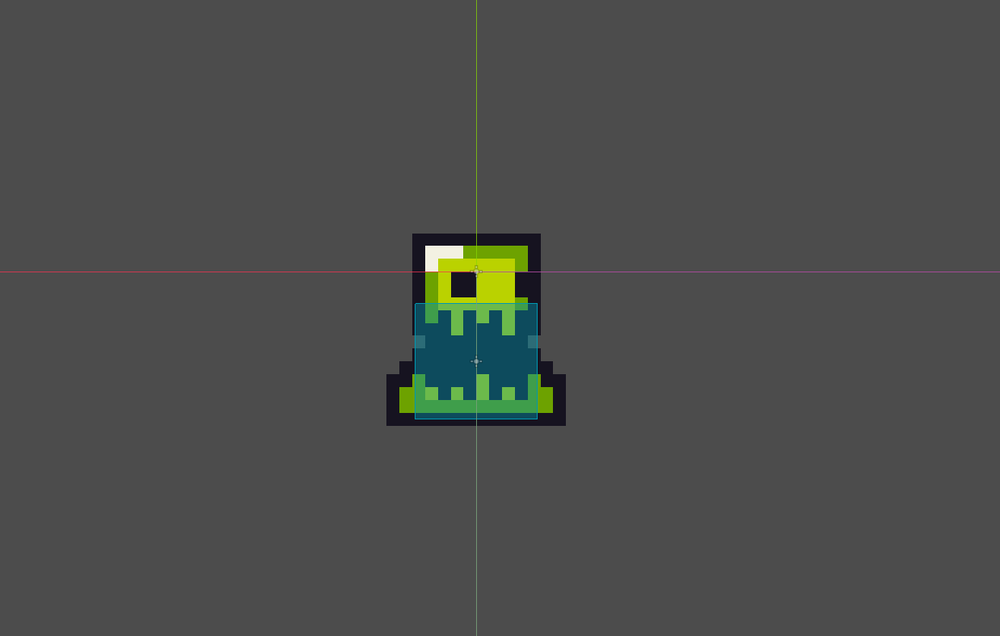
*图 6-7：史莱姆碰撞体设置*

**为什么需要 CollisionShape2D？**

`CharacterBody2D` 自身没有碰撞体积，必须配合 `CollisionShape2D` 才能与地图墙壁发生物理碰撞，防止史莱姆穿墙。

**操作步骤：**
1. 选中 `slime` 根节点，按 `Ctrl+A` 添加 `CollisionShape2D`
2. 在检视器 `Shape` 下拉菜单中选择 `RectangleShape2D`
3. 调整大小使碰撞矩形略小于贴图，内缩 2~3 像素

**检视器关键属性：**

| 属性 | 建议值 | 说明 |
|------|--------|------|
| `Shape` | `RectangleShape2D` | 矩形碰撞体，适合矩形敌人 |
| `Shape → Size` | `约贴图大小 - 2~3px` | 略小于外观，避免视觉上"悬空"碰撞 |

---

### 6.5 步骤四：添加 Hitbox（Area2D + CollisionShape2D）

**当前场景树状态：**
```
slime（CharacterBody2D）
├── AnimatedSprite2D
├── CollisionShape2D
└── Hitbox（Area2D）        ← ✅ 刚刚添加
    └── CollisionShape2D   ← ✅ 同步添加
```

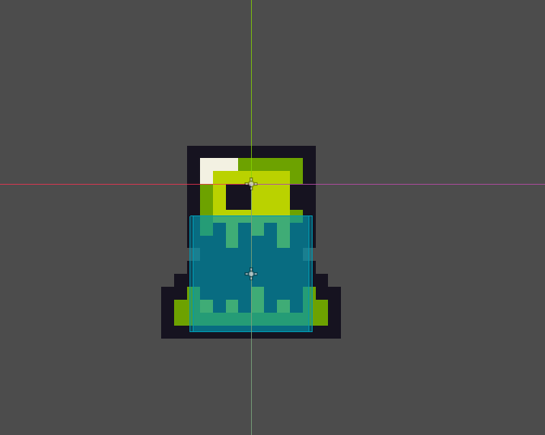
*图 6-8：史莱姆 Hitbox *

**为什么需要 Hitbox？**

史莱姆使用"冲锋攻击"机制：平时 `Hitbox` 关闭，不消耗性能；冲锋时由脚本打开，检测是否撞到玩家并造成伤害。

**操作步骤：**
1. 选中 `slime` 根节点，按 `Ctrl+A` 添加 `Area2D`，命名为 `Hitbox`
2. 选中 `Hitbox`，按 `Ctrl+A` 添加 `CollisionShape2D`，选择 `CircleShape2D`，半径与身体碰撞体相近
3. 在检视器中设置以下属性：

**检视器关键属性（Hitbox 节点）：**

| 属性 | 值 | 说明 |
|------|-----|------|
| `Monitoring` | `false` | 默认关闭检测，冲锋时由脚本开启 |
| `Monitorable` | `true` | 允许被子弹的 Area2D 检测到 |
| `Collision Layer` | 第 3 层（slime） | 子弹检测的目标层 |
| `Collision Mask` | 第 2 层（player） | 只检测玩家 |

---

### 6.6 步骤五：添加 HurtSound 和 JumpSound

**当前场景树状态：**
```
slime（CharacterBody2D）
├── AnimatedSprite2D
├── CollisionShape2D
├── Hitbox（Area2D）
│   └── CollisionShape2D
├── HurtSound（AudioStreamPlayer）  ← ✅ 刚刚添加
└── JumpSound（AudioStreamPlayer）  ← ✅ 刚刚添加
```

**为什么需要两个音效节点？**

- `HurtSound`：史莱姆**受伤**时播放，由 `take_damage()` 函数调用
- `JumpSound`：史莱姆**冲锋蓄力**时播放，由 AI 状态机调用

使用两个独立的 `AudioStreamPlayer` 可以同时播放不同音效，互不干扰。

**操作步骤：**
1. 选中 `slime` 根节点，按 `Ctrl+A` 添加 `AudioStreamPlayer`，命名为 `HurtSound`
2. 再次添加一个 `AudioStreamPlayer`，命名为 `JumpSound`
3. 在检视器中为每个节点的 `Stream` 字段导入对应音效文件

**检视器关键属性（两个节点相同）：**

| 属性 | 值 | 说明 |
|------|-----|------|
| `Stream` | 导入对应 `.wav` 文件 | 播放的音效文件 |
| `Autoplay` | `false` | 不自动播放，由脚本调用 `play()` |
| `Max Polyphony` | `1` | 同一时刻最多 1 个实例（避免叠音） |

---

### 6.7 完整场景确认（slime.tscn）

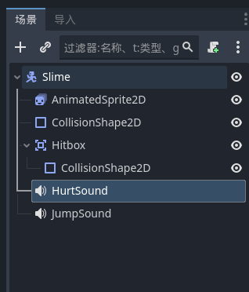  
*图 6-9：slime.tscn 最终节点树，共 7 个节点（含 Hitbox 子节点）*

```
slime（CharacterBody2D）
├── AnimatedSprite2D               ← 史莱姆外观和动画
├── CollisionShape2D               ← 身体物理碰撞（圆形）
├── Hitbox（Area2D）               ← 攻击检测区域（冲锋时开启）
│   └── CollisionShape2D           ← Hitbox 的碰撞范围
├── HurtSound（AudioStreamPlayer） ← 受伤音效
└── JumpSound（AudioStreamPlayer） ← 冲锋蓄力音效
```

> 按 `Ctrl+S` 保存场景，进入下一节附加脚本。

---

### 6.8 附加脚本（slime.gd）函数说明

**操作步骤：**
1. 选中根节点 `slime`，右键 → `创建脚本`，保存为 `scripts/slime.gd`

```gdscript
extends CharacterBody2D
```
继承 `CharacterBody2D`，可以使用 `move_and_slide()` 进行带物理碰撞的移动。

---

#### 常量与变量声明

```gdscript
const SPEED           = 100.0   # 追踪时的基础移动速度
const ATTACK_RANGE    = 40.0    # 开始蓄力攻击的距离阈值
const ATTACK_DAMAGE   = 10      # 每次命中对玩家造成的伤害
const ATTACK_COOLDOWN = 1.0     # 两次蓄力之间的冷却时间（秒）
const LUNGE_SPEED     = 400.0   # 冲锋时的速度
const LUNGE_DURATION  = 0.15    # 冲锋持续时间（秒）
const WINDUP_DURATION = 0.2     # 蓄力持续时间（秒）
const MAX_HP          = 30      # 最大生命值
const ACCELERATION    = 12.0    # 速度插值系数，越大响应越快
const BOUNCE_DURATION = 0.6     # 碰墙后反向移动的持续时间（秒）

var attack_timer    := 0.0          # 攻击冷却计时器，归零后才能再次蓄力
var player: Node    = null          # 玩家节点引用
var is_attacking    := false        # 是否处于攻击范围内状态
var lunge_timer     := 0.0          # 冲锋剩余时间，>0 表示正在冲锋
var lunge_direction := Vector2.ZERO # 冲锋方向（蓄力时锁定）
var windup_timer    := 0.0          # 蓄力剩余时间
var is_winding_up   := false        # 是否正在蓄力
var has_lunge_hit   := false        # 本次冲锋是否已命中过，防止同帧多次伤害
var hp              := MAX_HP       # 当前生命值
var health_bar: ProgressBar         # 动态创建的血条节点
var is_dead         := false        # 是否已死亡
var bounce_timer    := 0.0          # 碰墙反弹剩余时间
var bounce_direction := Vector2.ZERO # 反弹方向（碰墙时取法线）
```

> 所有计时器（`attack_timer`、`lunge_timer`、`windup_timer`、`bounce_timer`）都在 `_physics_process` 中每帧递减。

---

#### `_ready()` — 初始化

```gdscript
func _ready() -> void:
    process_mode = PROCESS_MODE_PAUSABLE  # 游戏暂停时，该节点停止更新
    add_to_group("slimes")                # 加入 "slimes" 组，供场景管理查找
    player = get_parent().get_node("MainCharacter")  # 获取玩家节点引用

    # 动态创建血条并挂到自身节点下
    health_bar = ProgressBar.new()
    health_bar.max_value       = MAX_HP
    health_bar.value           = hp
    health_bar.show_percentage = false   # 不显示百分比文字
    health_bar.position        = Vector2(-12, -18)  # 显示在头顶
    health_bar.size            = Vector2(24, 5)     # 细长条形
    add_child(health_bar)

    # 确保 death 动画只播一次，不循环
    $AnimatedSprite2D.sprite_frames.set_animation_loop("death", false)
```

> `PROCESS_MODE_PAUSABLE`：当 `get_tree().paused = true` 时，该节点停止执行 `_process` 和 `_physics_process`。
> `ProgressBar.new()` 在运行时动态创建血条节点，无需在编辑器里手动添加。

---

#### `_physics_process(delta)` — AI 状态机

史莱姆的行为按优先级排列，每帧只执行一个状态：

```
优先级：死亡 > 冲锋 > 蓄力 > 攻击范围内 > 追踪（含碰墙反弹）
```

```gdscript
func _physics_process(delta: float) -> void:
    if is_dead:
        return          # 死亡后停止一切逻辑
    if player == null:
        return          # 玩家不存在时跳过（场景切换保护）

    var to_player: Vector2 = player.global_position - global_position  # 指向玩家的向量
    var distance := to_player.length()                                  # 到玩家的距离

    if lunge_timer > 0.0:
        # ── 状态：冲锋 ──────────────────────────────────────
        lunge_timer -= delta
        velocity = lunge_direction * LUNGE_SPEED    # 高速冲向玩家
        if not has_lunge_hit:                       # 本次冲锋尚未命中
            for area in $Hitbox.get_overlapping_areas():
                if area.get_parent() == player:
                    has_lunge_hit = true            # 标记已命中，防止重复伤害
                    _attack_player()
                    break
        if lunge_timer <= 0.0:
            $Hitbox.monitoring = false              # 冲锋结束后关闭伤害检测
    elif is_winding_up:
        # ── 状态：蓄力 ──────────────────────────────────────
        velocity = velocity.lerp(Vector2.ZERO, ACCELERATION * delta)  # 减速停止
        windup_timer -= delta
        if windup_timer <= 0.0:                     # 蓄力完毕，发动冲锋
            is_winding_up = false
            lunge_timer   = LUNGE_DURATION
            has_lunge_hit = false
            $Hitbox.monitoring = true               # 开启伤害检测
            $JumpSound.play()                       # 播放冲锋音效
    elif distance <= ATTACK_RANGE:
        # ── 状态：攻击范围内 ────────────────────────────────
        is_attacking = true
        attack_timer -= delta
        if attack_timer <= 0.0:                     # 冷却好了就蓄力再冲
            attack_timer    = ATTACK_COOLDOWN       # 重置冷却
            lunge_direction = (player.global_position - global_position).normalized()
            windup_timer    = WINDUP_DURATION
            is_winding_up   = true
        velocity     = velocity.lerp(Vector2.ZERO, ACCELERATION * delta)
        bounce_timer = 0.0                          # 进入攻击范围后清除反弹状态
    else:
        # ── 状态：追踪 ──────────────────────────────────────
        is_attacking = false
        attack_timer = 0.0                          # 离开攻击范围时重置冷却
        if bounce_timer > 0.0:
            bounce_timer -= delta
            velocity = velocity.lerp(bounce_direction * SPEED, ACCELERATION * delta)
        else:
            # 判断水平/垂直哪个方向更接近玩家，优先那个方向移动
            var target_vel: Vector2
            if abs(to_player.x) >= abs(to_player.y):
                target_vel = Vector2(sign(to_player.x), 0) * SPEED
            else:
                target_vel = Vector2(0, sign(to_player.y)) * SPEED
            velocity = velocity.lerp(target_vel, ACCELERATION * delta)

    move_and_slide()

    # 碰墙检测（仅追踪阶段且未处于反弹/蓄力/冲锋中）
    if is_on_wall() and bounce_timer <= 0.0 and not is_attacking and not is_winding_up and lunge_timer <= 0.0:
        var normal := Vector2.ZERO
        for i in get_slide_collision_count():
            normal += get_slide_collision(i).get_normal()  # 累加所有碰撞面的法线
        # 若法线有效则使用，否则用速度反向作为退离方向
        bounce_direction = normal.normalized() if normal.length_squared() > 0.0 else -velocity.normalized()
        bounce_timer = BOUNCE_DURATION

    # 动画切换
    var anim := $AnimatedSprite2D
    if is_attacking:
        anim.play("attack")
    else:
        anim.play("idle")
```

> `lerp(a, b, t)` = 线性插值，每帧向目标靠近 `t` 比例。`ACCELERATION * delta` 让过渡速度与帧率无关。
> `has_lunge_hit` 标志确保同一次冲锋只对玩家造成一次伤害，避免多帧重复扣血。

---

#### `_attack_player()` — 对玩家造成伤害

```gdscript
func _attack_player() -> void:
    if player.has_method("take_damage"):
        player.take_damage(ATTACK_DAMAGE)
```

> `has_method()` 先检查玩家是否有 `take_damage` 方法，防止因节点引用失效导致报错。

---

#### `take_damage(amount)` — 接受伤害

```gdscript
func take_damage(amount: int) -> void:
    if is_dead:
        return                  # 已死亡时忽略伤害
    hp -= amount
    hp = max(0, hp)             # 生命值不低于 0
    health_bar.value = hp       # 更新血条显示
    $HurtSound.play()           # 播放受伤音效
    if hp <= 0:
        _die()
```

> 子弹命中史莱姆后会调用此函数。`max(0, hp)` 防止血量变为负数。

---

#### `_die()` — 死亡处理

```gdscript
func _die() -> void:
    is_dead = true
    $CollisionShape2D.set_deferred("disabled", true)  # 禁用碰撞，其他物体不再能碰到它
    $Hitbox.monitoring  = false   # 停止主动检测
    $Hitbox.monitorable = false   # 不再被其他物体检测到（子弹穿过它）
    health_bar.hide()
    $AnimatedSprite2D.play("death")
    $AnimatedSprite2D.animation_finished.connect(queue_free)  # 动画播完后删除整个节点
```

> `animation_finished.connect(queue_free)` 将信号直接连接到函数，动画一结束就自动调用 `queue_free()`。

---

## 第七章：武器与子弹场景

> 本章包含两个独立场景：`handgun.tscn`（手枪外观）和 `bullet.tscn`（子弹逻辑），同样从空白出发，逐步添加节点。

**本章结束后，你将拥有两个完整的武器场景：**

```
handgun（Node2D）
└── AnimatedSprite2D           ← 手枪贴图
```
```
bullet（Area2D）
├── AnimatedSprite2D           ← 子弹外观
├── CollisionShape2D           ← 子弹碰撞体
└── RayCast2D                  ← 前方墙体检测射线
```

---

## 一、手枪场景（handgun.tscn）

### 7.1 创建空白场景文件（handgun.tscn）

**当前场景树状态：**
```
（空）
```

**操作步骤：**
1. 点击工作区标签栏的 `+` 新建场景
2. 按 `Ctrl+S` 保存为 `handgun.tscn`，保存到 `scenes/` 目录

---

### 7.2 步骤一：添加根节点 Node2D

**当前场景树状态：**
```
HandGun（Node2D）    ← ✅ 刚刚添加
```


**为什么选 Node2D？**

手枪本身不需要物理碰撞，只需要跟随 `GunPivot` 旋转显示外观，选最简单的 `Node2D` 作根节点，避免引入不必要的物理开销。

**操作步骤：**
1. 在空白场景树中点击 `+`，搜索并添加 `Node2D`
2. 双击节点名称，重命名为 `handgun`
3. 按 `Ctrl+S` 保存

---

### 7.3 步骤二：添加 AnimatedSprite2D（手枪外观）

**当前场景树状态：**
```
handgun（Node2D）
└── AnimatedSprite2D    ← ✅ 刚刚添加
```

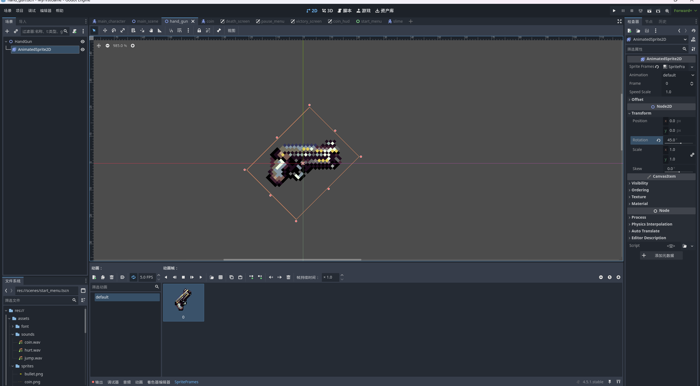
*图 7-1：添加 AnimatedSprite2D 后手枪贴图出现在视口中*

**操作步骤：**
1. 选中 `handgun` 根节点，按 `Ctrl+A` 添加 `AnimatedSprite2D`
2. 在检视器中点击 `Sprite Frames` → `新建 SpriteFrames`，导入手枪贴图帧

**检视器关键属性：**

| 属性 | 建议值 | 说明 |
|------|--------|------|
| `Sprite Frames` | 新建并导入手枪图片 | 可以只有一帧静态图 |
| `Rotation` | `45` | `GunPivot` 旋转以原点为轴，枪柄应在原点附近 |

---

### 7.4 handgun.tscn 完整确认


```
handgun（Node2D）              ← 根节点，不需要物理能力
└── AnimatedSprite2D           ← 手枪外观贴图
```

> 保存后，该场景将在本章 **7.10** 节中被拖入玩家场景的 `GunPivot` 节点下作为实例使用。

---

## 二、子弹场景（bullet.tscn）

### 7.5 创建空白场景文件（bullet.tscn）

**当前场景树状态：**
```
（空）
```

**操作步骤：**
1. 点击工作区标签栏的 `+` 新建场景
2. 按 `Ctrl+S` 保存为 `bullet.tscn`，保存到 `scenes/` 目录

---

### 7.6 步骤一：添加根节点 Area2D

**当前场景树状态：**
```
bullet（Area2D）    ← ✅ 刚刚添加
```


**为什么选 Area2D？**

子弹需要检测"是否飞入了史莱姆的 Hitbox 范围"，`Area2D` 专门用于区域重叠检测。当子弹（Area2D）和史莱姆的 Hitbox（也是 Area2D）重叠时，会触发 `area_entered` 信号，代码据此扣除伤害。

**操作步骤：**
1. 在空白场景树中点击 `+`，添加 `Area2D`
2. 重命名为 `bullet`
3. 按 `Ctrl+S` 保存

**检视器关键属性：**

| 属性 | 建议值 | 说明 |
|------|--------|------|
| `Collision Layer` | 第 4 层（bullet） | 子弹"属于"bullet层 |
| `Collision Mask` | 第 3 层（slime） | 只检测史莱姆层的 Hitbox，不误触其他物体 |

---

### 7.7 步骤二：添加 AnimatedSprite2D（子弹外观）

**当前场景树状态：**
```
bullet（Area2D）
└── AnimatedSprite2D    ← ✅ 刚刚添加
```

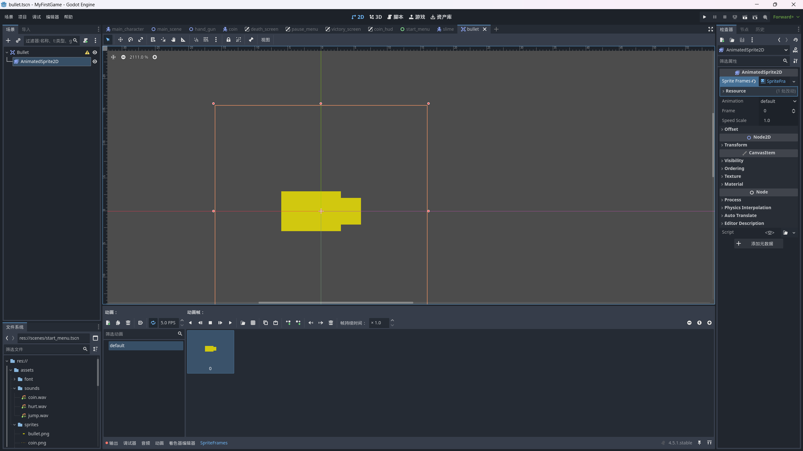  
*图 7-2：添加 AnimatedSprite2D 后子弹贴图出现在视口中*

**操作步骤：**
1. 选中 `bullet` 根节点，按 `Ctrl+A` 添加 `AnimatedSprite2D`
2. 导入子弹贴图（通常是小亮点或细长形状）

**检视器关键属性：**

| 属性 | 建议值 | 说明 |
|------|--------|------|
| `Sprite Frames` | 导入子弹图片 | 可以是静态一帧|

---

### 7.8 步骤三：添加 CollisionShape2D（子弹碰撞体）

**当前场景树状态：**
```
bullet（Area2D）
├── AnimatedSprite2D
└── CollisionShape2D    ← ✅ 刚刚添加
```

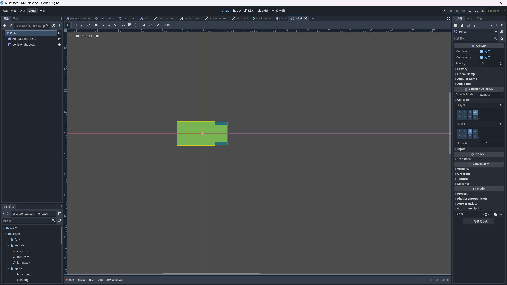
*图 7-3：子弹碰撞体使用细长形状，沿飞行方向拉长*

**为什么需要 CollisionShape2D？**

`Area2D` 同样需要 `CollisionShape2D` 来定义检测范围的形状。子弹使用细长的碰撞形状，沿飞行方向延伸，这样飞行时不易漏检。

**操作步骤：**
1. 选中 `bullet` 根节点，按 `Ctrl+A` 添加 `CollisionShape2D`
2. 在检视器中选择 `RectangleShape2D`，调整为细长形状

**检视器关键属性：**

| 属性 | 建议值 | 说明 |
|------|--------|------|
| `Shape` | `RectangleShape2D` | 矩形形 |

---

### 7.9 步骤四：添加 RayCast2D（墙体穿透检测）

**当前场景树状态：**
```
bullet（Area2D）
├── AnimatedSprite2D
├── CollisionShape2D
└── RayCast2D           ← ✅ 刚刚添加
```

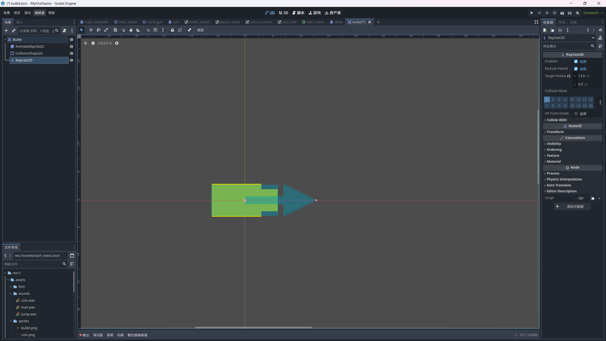
*图 7-4：RayCast2D 绿色箭头指向子弹飞行方向，用于提前检测前方墙体*

**为什么需要 RayCast2D？**

`Area2D` 的碰撞检测在每帧末才更新，高速子弹可能一帧内"穿过"薄墙。`RayCast2D` 在每个物理帧都向前探测，只要前方有墙就立刻销毁子弹，彻底防止穿墙。

**操作步骤：**
1. 选中 `bullet` 根节点，按 `Ctrl+A` 添加 `RayCast2D`
2. 在检视器中设置以下属性

**检视器关键属性：**

| 属性 | 值 | 说明 |
|------|-----|------|
| `Target Position` | `Vector2(20, 0)` | 射线长度和方向（沿本地 X 轴正方向，即子弹飞行方向） |
| `Collision Mask` | 第 1 层（world） | 只检测地图/墙壁层 |
| `Collide With Bodies` | `true` | 检测 TileMapLayer 等物理体（墙壁） |
| `Collide With Areas` | `false` | 不检测 Area2D，避免误触 |
| `Enabled` | `true` | 勾选后射线才会生效 |

> **💡 说明**：由于子弹的 `rotation` 与飞行方向一致，`RayCast2D` 的本地 +X 方向就是子弹飞行方向，无需额外旋转。

> **💡 提示**：建议将 `RayCast2D` 的 `Target Position` 设置为适中的距离（可以反复开启场景测试），以免距离墙体过远就会销毁子弹或者子弹穿墙。
---

## 三、将手枪安装到玩家场景（返回 main_character.tscn）

> `handgun.tscn` 已制作完成，现在可以返回玩家场景，将手枪安装到角色身上。

### 7.10 步骤五：添加 GunPivot（枪械旋转系统）

**当前场景树状态（main_character.tscn）：**
```
MainCharacter（CharacterBody2D）
├── AnimatedSprite2D
├── CollisionShape2D
├── Hitbox（Area2D）
│     └── CollisionShape2D
├── HurtSound（AudioStreamPlayer）
└── GunPivot（Node2D）            ← ✅ 刚刚添加
      ├── handgun（实例）         ← ✅ 拖入 handgun.tscn
      └── Muzzle（Node2D）        ← ✅ 枪口标记
```

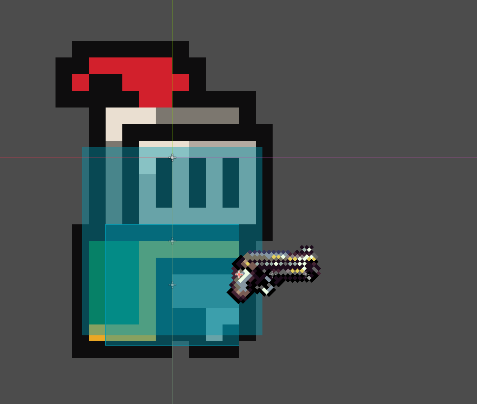
*图 7-5：GunPivot 的位置需对准角色握枪的手部*

**为什么需要这三个节点？**

- **`GunPivot`（Node2D）**：一个空节点，作为枪的旋转轴心。代码让它朝向鼠标，枪就会跟着旋转。
- **`handgun`（子场景实例）**：手枪的外观贴图，放在 `GunPivot` 下随其旋转。
- **`Muzzle`（Node2D）**：一个空节点，标记枪口位置。子弹生成时以它的全局坐标为起点，确保子弹从枪管末端飞出。

**操作步骤：**
1. 在文件系统中双击打开 `scenes/main_character.tscn`
2. 选中 `MainCharacter` 根节点，按 `Ctrl+A` 添加 `Node2D`，重命名为 `GunPivot`
3. 在 2D 视口中将 `GunPivot` 的 **Position 移到角色手部位置**
4. 选中 `GunPivot`，将文件系统中的 **`handgun.tscn` 拖入场景树**（作为实例子节点）
5. 选中 `GunPivot`，按 `Ctrl+A` 添加 `Node2D`，重命名为 `Muzzle`
6. 在 2D 视口中将 `Muzzle` 移动到枪管末端位置


**检视器关键属性（GunPivot）：**

| 属性 | 建议值 | 说明 |
|------|--------|------|
| `Transform` -> `Position` | 角色手部坐标（参照坐标`(4, 7)`） | 枪绕此点旋转，需根据角色贴图手动调整 |

**检视器关键属性（Muzzle）：**

| 属性 | 建议值 | 说明 |
|------|--------|------|
| `Transform` -> `Position` | 枪管末端坐标（参照坐标`(4, 0)`） | 子弹生成起点，X 轴沿枪管方向向外偏移 |

> 按 `Ctrl+S` 保存 `main_character.tscn`。

---

### 7.11 玩家脚本中的枪械控制

> 现在 `handgun.tscn` 和 `bullet.tscn` 都已完成，可以在玩家脚本（`main_character.gd`）中添加枪械射击逻辑。

**需要在 `main_character.gd` 中进行以下额外更改：**

#### 第一步：在顶部添加枪械相关常量

在脚本文件顶部（其他 `const` 旁边）添加：

```gdscript
const AUTO_AIM_RANGE  = 200.0  # 自动瞄准距离（像素）
const SHOOT_COOLDOWN  = 0.4    # 射击间隔（秒），防止点击过快连射
const BULLET_SCENE    = preload("res://scenes/bullet.tscn")
```

> `preload` 在游戏启动时就加载资源，避免每次射击时才加载导致小卡顿。
> `AUTO_AIM_RANGE` 用于在范围内自动锁定最近的史莱姆，让玩家不必精确移动鼠标。

在变量区添加射击冷却计时器：

```gdscript
var shoot_timer := 0.0
```

#### 第二步：在 `_process` 中更新枪口朝向

新增 `_process` 函数（注意：枪口逻辑放在 `_process` 而非 `_physics_process`，因为它只涉及旋转，不需要物理同步）：

```gdscript
func _process(delta: float) -> void:
    if is_dead:
        return
    shoot_timer = max(0.0, shoot_timer - delta)  # 每帧递减冷却计时
    _update_gun()
```

#### 第三步：添加 `_update_gun()` 枪口朝向函数

```gdscript
func _update_gun() -> void:
    var gun_pivot := $GunPivot
    var nearest := _get_nearest_slime()  # 查找范围内最近的史莱姆

    if nearest != null:
        # 范围内自动瞄准最近的怪物
        gun_pivot.look_at(nearest.global_position)
    else:
        # 范围外跟随鼠标
        gun_pivot.look_at(get_global_mouse_position())
    # 枪朝左时翻转Y轴，防止手枪倒置显示
    gun_pivot.scale.y = -1.0 if cos(gun_pivot.rotation) < 0 else 1.0
```

> `look_at(position)` 让节点转向指定全局坐标点，`GunPivot` 的本地 +X 方向始终指向目标。
> `scale.y = -1.0` 当枪口朝左（`cos < 0`）时翻转Y轴，避免手枪图片上下颠倒。

#### 第四步：添加 `_get_nearest_slime()` 自动瞄准函数

```gdscript
func _get_nearest_slime() -> Node:
    var nearest: Node = null
    var nearest_dist := AUTO_AIM_RANGE
    for slime in get_tree().get_nodes_in_group("slimes"):
        if slime.get("is_dead") == true:
            continue  # 跳过已死亡的史莱姆
        var dist := global_position.distance_to(slime.global_position)
        if dist < nearest_dist:
            nearest_dist = dist
            nearest = slime
    return nearest
```

> `get_nodes_in_group("slimes")` 获取所有加入 `"slimes"` 组的史莱姆节点（即 slime.gd 中 `add_to_group("slimes")` 注册的）。

#### 第五步：用 `_input()` 处理射击输入

新增 `_input` 函数处理鼠标点击（比 `_physics_process` 更适合处理单次按键事件）：

```gdscript
func _input(event: InputEvent) -> void:
    if is_dead or is_dashing:
        return
    if event is InputEventMouseButton:
        if event.button_index == MOUSE_BUTTON_LEFT and event.pressed:
            if shoot_timer <= 0.0:       # 冷却好了才能射击
                _shoot($GunPivot)
                shoot_timer = SHOOT_COOLDOWN
```

> `InputEventMouseButton` 只在鼠标按键状态改变时触发，`event.pressed` 为 `true` 表示按下（而非松开）。
> `shoot_timer <= 0.0` 控制射击间隔，避免快速连点时每帧都发射子弹。

#### 第六步：添加 `_shoot()` 函数

```gdscript
func _shoot(gun_pivot: Node2D) -> void:
    var bullet := BULLET_SCENE.instantiate()  # 从 bullet.tscn 创建一个新实例
    var dir := Vector2(cos(gun_pivot.global_rotation), sin(gun_pivot.global_rotation))
    bullet.direction      = dir               # 子弹飞行方向 = 枪口朝向
    bullet.rotation       = dir.angle()       # 子弹自身旋转角度（使外观贴合方向）
    bullet.extra_velocity = velocity          # 叠加玩家当前移动速度
    var muzzle_pos: Vector2 = $GunPivot/Muzzle.global_position
    get_tree().current_scene.add_child(bullet)  # 将子弹加入场景根节点（不跟随玩家移动）
    bullet.global_position = muzzle_pos        # 子弹从枪口位置出发
```

> 子弹加入 `current_scene`（场景根节点）而非玩家自身子节点，这样子弹不会随玩家一起移动。
> `bullet.rotation = dir.angle()` 让子弹节点的视觉朝向与飞行方向一致。

---

### 7.12 完整场景确认（bullet.tscn）


```
bullet（Area2D）               ← 根节点，用于检测与史莱姆 Hitbox 重叠
├── AnimatedSprite2D           ← 子弹外观贴图
├── CollisionShape2D           ← 子弹碰撞体（细长形）
└── RayCast2D                  ← 前方射线，检测墙体
```

> 按 `Ctrl+S` 保存场景，进入下一节附加脚本。

---

### 7.13 附加脚本（bullet.gd）函数说明

**操作步骤：**
1. 选中根节点 `bullet`，右键 → `创建脚本`，保存为 `scripts/bullet.gd`

```gdscript
extends Area2D
```
继承 `Area2D`，可以接收 `area_entered` 信号以检测命中。

---

#### 常量与变量声明

```gdscript
const SPEED    = 500.0  # 子弹飞行速度
const DAMAGE   = 15     # 命中时对史莱姆造成的伤害
const LIFETIME = 1.0    # 子弹最大存活时间（秒），超时自动销毁

var direction      := Vector2.RIGHT  # 子弹飞行方向（由 _shoot() 赋值）
var extra_velocity := Vector2.ZERO   # 继承自玩家的初速度（叠加后子弹不会因玩家移动而变慢）
var _lifetime      := LIFETIME       # 当前剩余存活时间
```

> `extra_velocity` 实现了物理上的"速度叠加"：玩家向右跑动时射出的子弹会比站立时飞得更快。

---

#### `_ready()` — 连接命中信号

```gdscript
func _ready() -> void:
    area_entered.connect(_on_area_entered)  # 将 area_entered 信号连接到处理函数
```

> `area_entered` 信号在有其他 `Area2D` 进入子弹的碰撞区域时触发。这里用代码连接代替编辑器连接，确保脚本自包含。

---

#### `_physics_process(delta)` — 子弹移动与墙体检测

```gdscript
func _physics_process(delta: float) -> void:
    # 每帧移动：基础方向速度 + 继承自玩家的额外速度（矢量叠加）
    position += (direction * SPEED + extra_velocity) * delta

    _lifetime -= delta
    if _lifetime <= 0.0:
        queue_free()   # 超时销毁（queue_free：安全删除节点，本帧结束后执行）
        return

    # RayCast2D 在每个物理帧自动更新，直接查询结果
    if $RayCast2D.is_colliding():
        var collider: Node2D = $RayCast2D.get_collider()
        # collider != null 空值检查后，再判断组别
        # 不是玩家也不是史莱姆 → 视为墙壁 → 销毁子弹
        if collider != null and not collider.is_in_group("player") and not collider.is_in_group("slimes"):
            queue_free()
```

> `collider != null` 检查防止 `RayCast2D` 检测到已被销毁的节点时引发空引用错误。

---

#### `_on_area_entered(area)` — 命中史莱姆

```gdscript
func _on_area_entered(area: Area2D) -> void:
    # area 是进入子弹检测范围的 Area2D（即史莱姆的 Hitbox）
    var parent := area.get_parent()   # 获取 Hitbox 的父节点（史莱姆本体）
    if parent != null and parent.has_method("take_damage") and not parent.is_in_group("player"):
        parent.take_damage(DAMAGE)    # 对史莱姆造成伤害
        queue_free()                  # 子弹命中后销毁
```

> `has_method("take_damage")` 检查节点是否有该函数，避免对没有血量系统的节点调用导致报错。

---

**完成以上脚本编写后，记得在主场景中的`_ready()`函数中取消胜利场景的注释以测试游戏**  
**记得在场景中放置史莱姆以正常测试游戏**

# 附录 A：Godot 编辑器快捷键速查

### A.1 运行与调试

| 快捷键 | 功能 |
|--------|------|
| `F5` | 运行整个项目（从主场景开始） |
| `F6` | 运行当前打开的场景 |
| `F7` | 单步暂停（调试模式下） |
| `F8` | 停止运行游戏 |

---

### A.2 场景与文件操作

| 快捷键 | 功能 |
|--------|------|
| `Ctrl+S` | 保存当前文件/场景 |
| `Ctrl+Shift+S` | 场景另存为 |
| `Ctrl+Z` | 撤销 |
| `Ctrl+Y` | 重做 |
| `Ctrl+C` | 复制选中节点 |
| `Ctrl+V` | 粘贴节点 |
| `Ctrl+D` | 原地复制（Duplicate）选中节点 |
| `Ctrl+X` | 剪切节点 |
| `Delete` | 删除选中节点 |
| `Ctrl+A` | 向当前选中节点添加子节点 |
| `Ctrl+Shift+A` | 在选中节点的同级添加节点 |

---

### A.3 2D 视口操作

| 快捷键 | 功能 |
|--------|------|
| `Q` | 选择工具（点选/框选节点） |
| `W` | 移动工具（拖动节点位置） |
| `E` | 旋转工具 |
| `S` | 缩放工具 |
| `R` | 标尺/矩形工具（TileMap 绘制时） |
| `空格 + 拖动` | 平移视口画布 |
| `鼠标滚轮` | 缩放视口 |
| `Ctrl+滚轮` | 精细缩放视口 |
| `数字键 1` | 将视口缩放重置为 100% |
| `Ctrl+Shift+F` | 聚焦到选中节点（使节点居中显示） |

---

### A.4 脚本编辑器

| 快捷键 | 功能 |
|--------|------|
| `Ctrl+F` | 在当前脚本中搜索 |
| `Ctrl+H` | 搜索并替换 |
| `Ctrl+G` | 跳转到指定行号 |
| `Ctrl+/` | 注释/取消注释选中行 |
| `Tab` | 增加缩进 |
| `Shift+Tab` | 减少缩进 |
| `Ctrl+Space` | 触发代码补全 |
| `Ctrl+Click` | 跳转到函数/变量定义处 |
| `Alt+Up/Down` | 将当前行上移/下移 |
| `Ctrl+Shift+C` | 复制选中行（不剪切原行） |
| `F1` 或 `Ctrl+F1` | 查看选中关键字的官方文档 |

---

### A.5 场景树操作

| 快捷键 | 功能 |
|--------|------|
| `F2` | 重命名选中节点 |
| `Ctrl+↑ / Ctrl+↓` | 在兄弟节点间移动（调整顺序） |
| `Alt+Click` 展开箭头 | 递归展开/折叠子树 |

---

## 附录 B：Windows 系统开发常用快捷键

### B.1 文件与窗口管理

| 快捷键 | 功能 |
|--------|------|
| `Win+E` | 打开文件资源管理器 |
| `Win+D` | 显示桌面（最小化所有窗口） |
| `Alt+Tab` | 在打开的应用程序间切换 |
| `Win+Tab` | 任务视图（查看所有打开窗口） |
| `Win+←/→` | 将当前窗口贴靠到屏幕左/右半边 |
| `Win+↑` | 最大化当前窗口 |
| `Win+↓` | 还原/最小化当前窗口 |
| `Alt+F4` | 关闭当前窗口/程序 |
| `Ctrl+Shift+Esc` | 直接打开任务管理器（查看 CPU/内存占用） |

---

### B.2 文件管理器操作

| 快捷键 | 功能 |
|--------|------|
| `F2` | 重命名选中文件/文件夹 |
| `F5` | 刷新文件列表 |
| `Ctrl+N` | 新建文件夹 |
| `Ctrl+A` | 全选 |
| `Ctrl+Z` | 撤销文件操作（如误删可恢复） |
| `Delete` | 移入回收站 |
| `Shift+Delete` | 永久删除（不经过回收站，谨慎使用） |
| `Alt+←` | 返回上一级目录 |
| `Alt+D` | 选中地址栏（可直接输入路径） |
| `Ctrl+Shift+N` | 新建文件夹 |

---


### B.4 文本与剪贴板

| 快捷键 | 功能 |
|--------|------|
| `Ctrl+C` | 复制 |
| `Ctrl+X` | 剪切 |
| `Ctrl+V` | 粘贴 |
| `Ctrl+Z` | 撤销 |
| `Ctrl+A` | 全选 |
| `Ctrl+F` | 在当前程序中搜索 |
| `Win+V` | 打开剪贴板历史（可粘贴最近复制的多条内容） |

> **💡 提示**：`Win+V` 的剪贴板历史默认可能未开启，首次使用时按照提示打开即可。

